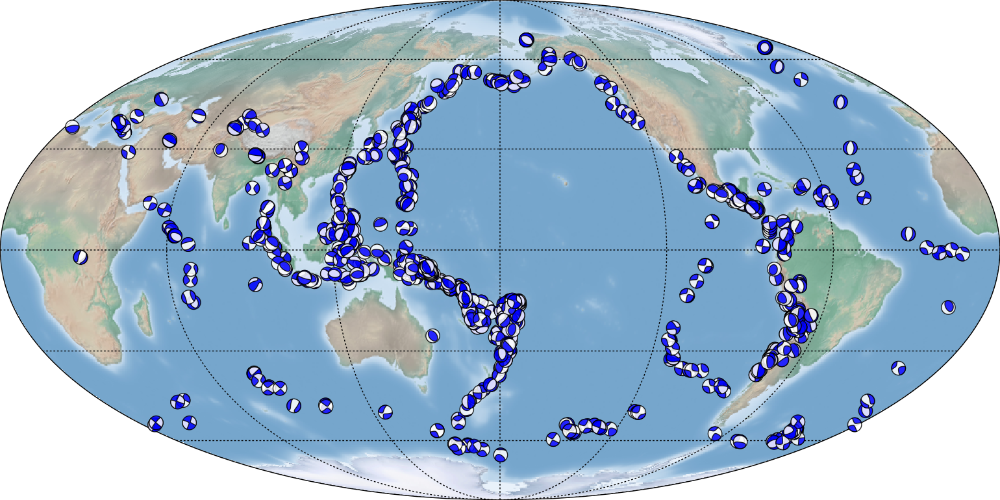
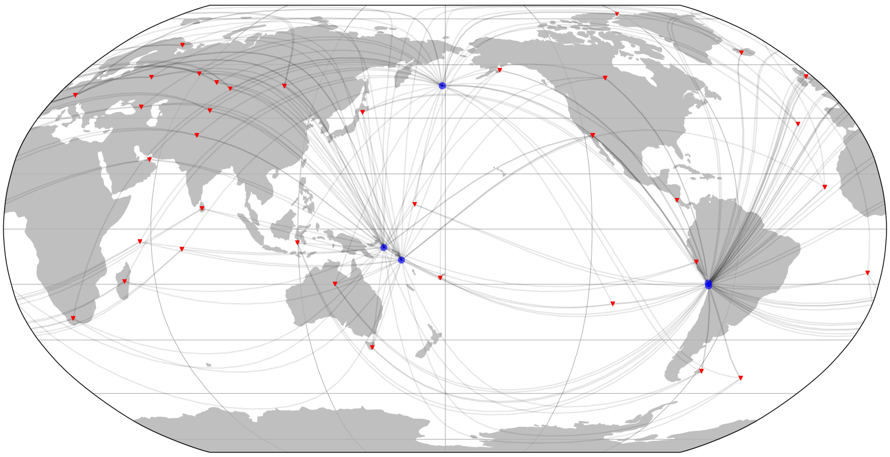
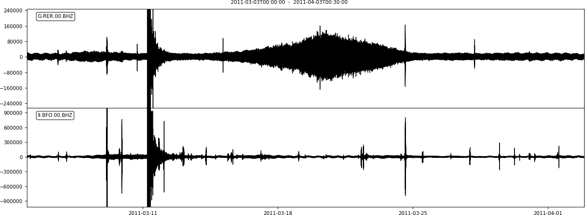

# obspyDMT: A Python Toolbox for Retrieving, Processing and Management of Seismological Datasets

[obspyDMT][dmt] (obspy Data Management Tool) is a command line tool for retrieving, processing and management of seismological datasets in a fully automatic way.

Table of contents
-----------------

* [Gallery](#gallery)
   *  [Quick tour](#quick-tour): run a quick tour.
   *  [Earthquake meta-data](#earthquake-meta-data): get info about events without downloading waveforms.
   *  [Seismicity map](#seismicity-map)
   *  [Event-based mode](#event-based-mode):  retrieve waveforms, stationXML/response files and meta-data of all the requested stations for all the events found in the archive.
   *  [Update an existing data set](#update-an-existing-data-set)
   *  [Time-continuous mode](#time-continuous-mode): retrieve waveforms, stationXML/response files and meta-data of all the requested stations for the requested time window.
   *  [Processing and instrument correction](#processing-and-instrument-correction): process the data automatically after the data retrieval and/or on an existing data-set.
   *  [Synthetic seismograms](#synthetic-seismograms)
   *  [Explore station meta-data (StationXML files, filterstages)](#explore-station-meta-data-stationxml-files-filterstages):
   *  [Speeding up data retrieval by parallelization](#speeding-up-data-retrieval-by-parallelization): send the requests and/or process the data in parallel. This section introduces some options (*bulk* and *parallel retrieving and processing*) to speed-up the whole procedure.
   *  [KML](#KML)

*  [Supported event catalogs and data centers](#supported-event-catalogs-and-data-centers): available event catalogs and data centers.
*  [Directory structure](#directory-structure): the way that obspyDMT organizes your retrieved and processed data.
*  [How to cite obspyDMT](#how-to-cite-obspydmt)
*  [Installation](#installation): install obspyDMT and check the installation on your local machine.

## Gallery


| **Quick tour**                                                 <a href="#quick-tour">                                                 | **Earthquake meta-data**                            <a href="#earthquake-meta-data">                    |
| -------------------------------------------------------------------------------------------------------------------------------------------------------------------- | -------------------------------------------------------------------------------------------------------------------------------------------------- |
| **Seismicity map**                                             <a href="#seismicity-map">                                           | **Event-based mode**                                <a href="#event-based-mode">                                |
| **Update an existing data set**                                <a href="#update-an-existing-data-set">                        | **Time-continuous mode**                            <a href="#time-continuous-mode">                            |
| **Processing and instrument correction**                       <a href="#processing-and-instrument-correction">                       | **Synthetic seismograms**                           <a href="#synthetic-seismograms">                               |
| **Explore station meta-data (StationXML files, filterstages)** <a href="#explore-station-meta-data-stationxml-files-filterstages">   | **Speeding up data retrieval by parallelization**   <a href="#speeding-up-data-retrieval-by-parallelization">     |
| **KML**                                                        <a href="#kml">                                               | **VTK**                                             <a href="#vtk">                                                       |


## Quick tour

Run a quick tour:

```bash
obspyDMT --tour
```

*dmt_tour_dir* directory will be created in the current path, and retrieved/processed waveforms as well as meta-data will be organized there (refer to `Directory structure`_ section for more information).

The retrieved waveforms can be plotted by:

```bash
obspyDMT --datapath dmt_tour_dir --local --plot_waveform
```


To plot the processed/corrected waveforms, ``--plot_dir_name processed`` can be added to the previous command line:

```bash
obspyDMT --datapath dmt_tour_dir --local --plot_waveform --plot_dir_name processed
```

.. image:: figures/quick_tour_corrected.png
   :scale: 60%
   :align: center

obspyDMT has several tools to plot the contents of a data set. As an example, the following command line plots the ray coverage (ray path between each source-receiver pair) of ``dmt_tour_dir`` directory:

```bash
obspyDMT --datapath dmt_tour_dir --local --plot_ev --plot_sta --plot_ray
```

.. image:: figures/quick_tour_ray.png
   :scale: 75%
   :align: center

## Earthquake meta-data

Get info about events without downloading/processing waveforms! This method can be used to check available events before starting an actual waveform retrieval, for example:

```bash
obspyDMT --datapath neic_event_metadata --min_mag 5.5 --min_date 2014-01-01 --max_date 2015-01-01 --event_catalog NEIC_USGS --event_info
```


The above directory (neic_event_metadata) can be updated for events that occured in 2015 of magnitude more than 5.5: (no waveform retrieval)

```bash
obspyDMT --datapath neic_event_metadata --min_mag 5.5 --min_date 2015-01-01 --max_date 2016-01-01 --event_catalog NEIC_USGS --event_info
```

To plot the content of local data set (neic_event_metadata):

```bash
obspyDMT --datapath neic_event_metadata --local --plot_ev --plot_focal
```


.. image:: figures/neic_event_focal_2014_2015.png
   :scale: 75%
   :align: center

## Seismicity map

Seismicity map (``--plot_seismicity`` option flag) of Japan region based on earthquakes of magnitude more than 5.0 that occured from 2000-01-01 until 2017-01-01 from NEIC event catalog.
Note ``--event_rect`` option flag to define a region around Japan:

```bash
obspyDMT --datapath japan_seismicity --min_mag 5.0 --min_date 2000-01-01 --max_date 2017-01-01 --event_catalog NEIC_USGS --event_rect 110./175./15/60 --plot_seismicity --event_info
```

.. image:: figures/japan_seismicity.png
   :scale: 75%
   :align: center

Global seismicity map of archived earthquakes in NEIC catalogue with magnitude more than 5.0 that occurred between 1990 and 2016.
One command queried the NEIC catalogue, stored and organised the retrieved information and generated the seismicity map.
(No actual waveform data were queried in this example):

```bash
obspyDMT --datapath neic_event_dir --min_date 1990-01-01 --max_date 2017-01-01 --min_mag 5.0 --event_catalog NEIC_USGS --event_info --plot_seismicity
```

.. image:: figures/neic_catalog_1990.png
   :scale: 75%
   :align: center

The results of some basic statistics (magnitude and depth histograms) are also generated and plotted automatically (top-left panel).
Note the rendering of coloured beach balls in the map inset (deepest seismicity in the foreground).
The global map also contains beach balls rather than just simple black dots, but they do not become apparent at this zoom level.


## Event-based mode

The following command retrieves actual BHZ seismograms from the IRIS data center that recorded earthquakes of magnitude more than 7.5 that occured from 2014-01-01 until
2015-01-01 (NEIC catalog). For this example, we only retrieve stations with station code ``II``, location code ``00`` and channel codes ``BHZ``.

```bash
obspyDMT --datapath event_based_dir --min_date 2014-01-01 --max_date 2015-01-01 --min_mag 7.5 --event_catalog NEIC_USGS --data_source IRIS --net "II" --loc "00" --cha "BHZ" --preset 100 --offset 1800
```

``--data_source`` specifies that the waveform data center of IRIS should be contacted for seismograms.
Omitting this flag would trigger the default ``--data_source IRIS``.
``--preset 100`` and ``--offset 1800`` specify the retrieval of waveform time windows of 100 s before to 1800 s after the reference time.
Since we are downloading in event-based mode, i.e., centered around earthquake occurrences, the reference time defaults to the event origin time.
This could be changed to the time of P-wave arrival by invoking ``--cut_time_phase``,
in which case each seismogram would have a different absolute start time.

To plot the stations/events/rays:

```bash
obspyDMT --datapath event_based_dir --local --plot_ev --plot_focal --plot_sta --plot_ray
```

.. image:: figures/iris_ev_based_mode.png
   :scale: 75%
   :align: center

## Update an existing data set

The following command updates the data-set that we created in the previous section with ``BHZ`` channels of ``C*`` networks (i.e., all stations that their network codes start with C)
from the ``GFZ`` data center:

```bash
obspyDMT --datapath event_based_dir --data_source "GFZ" --net "AW,E*" --cha "BHZ" --preset 100 --offset 1800
```

Additionally, we can update the data set with ``BHZ`` channels of ``G*`` networks (i.e., all stations that their network codes start with G)
from the ``IPGP`` data center:

```bash
obspyDMT --datapath event_based_dir --data_source "IPGP" --net "G*" --cha "BHZ" --preset 100 --offset 1800
```

To plot the stations/events/rays:

```bash
obspyDMT --datapath event_based_dir --local --plot_ev --plot_focal --plot_sta --plot_ray
```

.. image:: figures/iris_gfz_ipgp_ev_based.png
   :scale: 75%
   :align: center


To create KML file:

```bash
obspyDMT --datapath event_based_dir --local --plot_ev --plot_focal --plot_sta --plot_ray  --create_kml --min_date 2014-01-01
```

.. image:: figures/google_earth_us.jpg
   :scale: 75%
   :align: center

.. image:: figures/google_earth_indo.jpg
   :scale: 75%
   :align: center

.. image:: figures/google_earth_zoom.png
   :scale: 75%
   :align: center

## Time-continuous mode

```bash
obspyDMT --continuous --datapath continuous_example --min_date 2011-03-03 --max_date 2011-04-03 --sta "BFO,RER" --loc '00' --cha "BHZ" --data_source IRIS
```

.. image:: figures/continuous_example.png
   :scale: 75%
   :align: center

## Processing and instrument correction

obspyDMT can process the waveforms directly after retrieving the data, or it can process an existing data set in a separate step (local mode).
By default, obspyDMT follows processing instructions described in the ``process_unit.py`` located at ``/path/to/my/obspyDMT/obspyDMT`` directory.
Although this file is fully customizable, several common processing steps can be done via options flags (without changing/writing new processing instructions).

The following command retrieves all BHZ channels from the IRIS data center that:

- 50 <= Azimuth <= 55 (specified by ``--min_azi`` and ``--max_azi``)
- 94 <= Distance <= 100 (specified by ``--min_epi`` and ``max_epi``)
- recorded events of magnitude more than 6.8 that occured on ``2014-07-21``.

```bash
obspyDMT --datapath data_fiji_island --min_mag 6.8 --min_date 2014-07-21 --max_date 2014-07-22 --event_catalog NEIC_USGS --data_source IRIS --min_azi 50 --max_azi 55 --min_epi 94 --max_epi 100 --cha BHZ --instrument_correction
```

To plot the processed/corrected waveforms (Note ``--plot_dir_name processed``, omitting this option would result in plotting raw counts, i.e., ``--plot_dir_name raw``):

```bash
obspyDMT --datapath data_fiji_island --local --plot_waveform --plot_dir processed
```

.. image:: figures/fiji_processed.png
   :scale: 75%
   :align: center

## Synthetic seismograms

```bash
obspyDMT --datapath data_fiji_island --min_mag 6.8 --min_date 2014-07-21 --max_date 2014-07-22 --event_catalog NEIC_USGS --data_source IRIS --min_azi 50 --max_azi 55 --min_epi 94 --max_epi 100 --cha BHZ --instrument_correction --syngine --syngine_bg_model iasp91_2s
```

```bash
obspyDMT --datapath data_fiji_island --local --plot_waveform --plot_dir syngine_iasp91_2s
```

.. image:: figures/fiji_iasp91_2s.png
   :scale: 75%
   :align: center

```bash
obspyDMT --datapath data_fiji_island --local --data_source IRIS --min_azi 50 --max_azi 55 --min_epi 94 --max_epi 100 --cha BHZ --pre_process False --syngine --syngine_bg_model iasp91_2s
```

## Explore station meta-data (StationXML files, filterstages)

```bash
obspyDMT --datapath /path/to/STXML.IC.XAN.00.BHZ --plot_stationxml --plotxml_paz --plotxml_min_freq 0.0001
```

.. figure:: figures/ic_XAN.png
   :width: 30%
   :align: center

```bash
obspyDMT --datapath /path/to/STXML.GT.LBTB.00.BHZ --plot_stationxml --plotxml_paz --plotxml_min_freq 0.0001
```

.. image:: figures/ic_LBTB.png
   :scale: 75%
   :align: center

```bash
obspyDMT --datapath /path/to/STXML.GT.LBTB.00.BHZ --plot_stationxml --plotxml_min_freq 0.0001 --plotxml_allstages
```

.. image:: figures/ic_LBTB_stages.png
   :scale: 75%
   :align: center

## Speeding up data retrieval by parallelization

enable parallel waveform/response request with X threads.

```bash
--req_parallel --req_np X
```

enable parallel processing with X threads.

```bash
--parallel_process --process_np X
```

using the bulkdataselect web service. Since this method returns multiple channels of time series data for specified time ranges in one request, it speeds up the waveform retrieving.

```bash
--bulk
```

## KML

Take the example of `Event-based mode` section. To create a KML file (readable by Google-Earth) for each event in that data set:

```bash
obspyDMT --datapath event_based_dir --local --plot_ev --plot_sta --plot_focal --plot_ray --create_kml
```

.. image:: figures/KML_event_based_example.png
   :scale: 75%
   :align: center

## Supported event catalogs and data centers

Print supported data centers that can be passed as arguments to ``--data_source``:

```bash
obspyDMT --print_data_sources
```

Print supported earthquake catalogs that can be passed as arguments to ``--event_catalog``:

```bash
obspyDMT --print_event_catalogs
```

## Directory structure

obspyDMT organizes the data in a simple and efficient way. For each request, it creates a parent directory at *datapath* and arranges the retrieved data either in different event directories (*event-based request*) or in chronologically named directories (*continuous request*). It also creates a directory in which a catalog of all requested events/time spans are stored. Raw waveforms, StationXML/response files and corrected waveforms are collected in sub-directories. While retrieving the data, obspyDMT creates metadata files such as station/event location files, and they are all stored in *info* directory of each event.

.. image:: figures/dmt_dir_structure.png
   :scale: 80%
   :align: center

## How to cite obspyDMT

Cite the code:

    Kasra Hosseini (2017), obspyDMT (Version 2.0.0) [software] [https://github.com/kasra-hosseini/obspyDMT]


## Installation

Once a working Python and `ObsPy <https://github.com/obspy/obspy/wiki>`_ environment is available, obspyDMT can be installed:

**1. Source code:** The latest version of obspyDMT is available on GitHub. After installing `git <https://git-scm.com/book/en/v2/Getting-Started-Installing-Git>`_ on your machine:

```bash
git clone https://github.com/kasra-hosseini/obspyDMT.git /path/to/my/obspyDMT
```

obspyDMT can be then installed by:

```bash
cd /path/to/my/obspyDMT
pip install -e .
```

or

```bash
cd /path/to/my/obspyDMT
python setup.py install
```

**2. PyPi:** One simple way to install obspyDMT is via `PyPi <https://pypi.python.org/pypi>`_ (for the released versions):

```bash
pip install obspyDMT
```

obspyDMT can be used from a system shell without explicitly calling the *Python* interpreter. It contains various option flags for customizing the request. Each option has a reasonable default value, and the user can change them to adjust obspyDMT option flags to a specific request.

The following command gives all the available options with their default values:

```bash
obspyDMT --help
```

To better explore the available options, a list of "option groups" can be generated by:

```bash
obspyDMT --options
```

And to list the available options in each group: (e.g., if we want to list available options in group number 2 [path specification])

```bash
obspyDMT --list_option 2
```

To check the dependencies required for running the code properly:

```bash
obspyDMT --check
```


[dmt]: https://github.com/kasra-hosseini/obspyDMT
