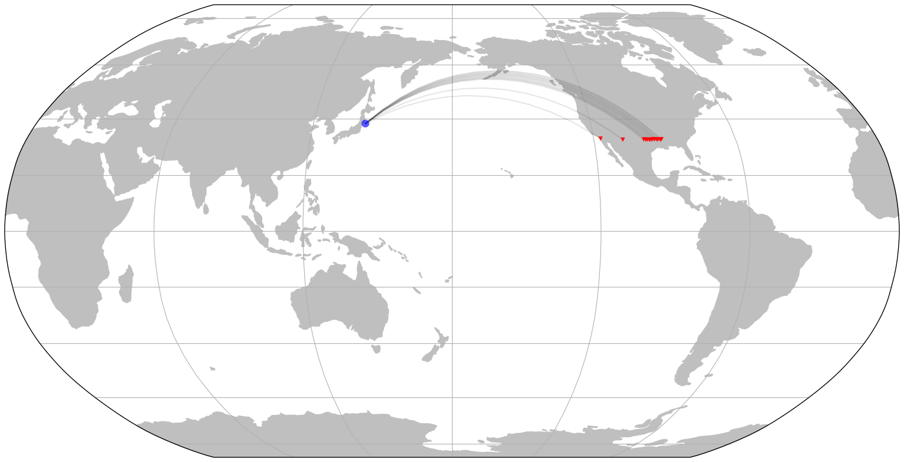
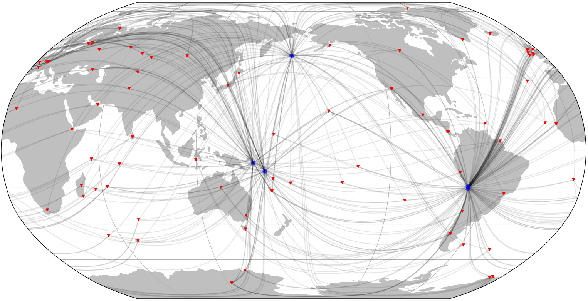
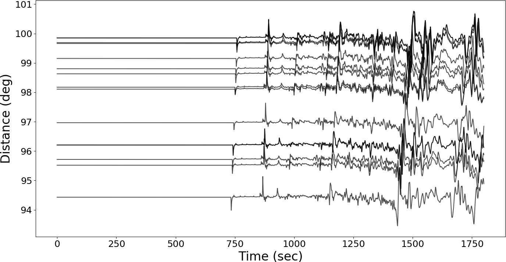
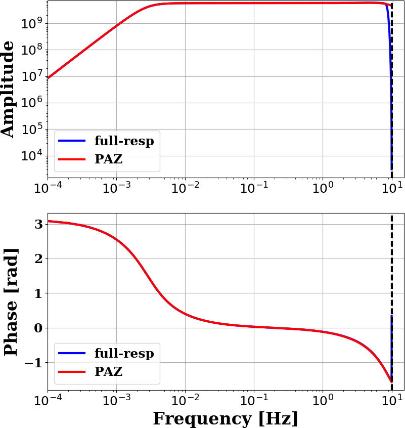

# obspyDMT: A Python Toolbox for Retrieving, Processing and Management of Seismological Datasets

[](https://doi.org/10.5281/zenodo.801778)

[obspyDMT][dmt] (obspy Data Management Tool) is a tool for retrieving, processing and management of seismological datasets in a fully automatic way. Written in the Python programming language (Python 2 and 3 compatible), it can be used as a stand-alone command-line tool (requiring no knowledge of Python) or can be integrated as a module with other Python codes.

Table of contents
-----------------

- [Gallery](#gallery)
   *  [Quick tour](#quick-tour): run a quick tour.
   *  [Earthquake meta-data](#earthquake-meta-data): request event information without downloading any waveforms.
   *  [Seismicity map](#seismicity-map)
   *  [Event-based mode](#event-based-mode): retrieve waveform data, stationXML/response files and meta-data from several different data centers.
   *  [Update an existing data set](#update-an-existing-data-set): request the same data again (in case that part of the earlier request failed), or expand the number of earthquakes, stations, or seismograms.
   *  [Time-continuous mode](#time-continuous-mode): retrieve waveforms, stationXML/response files and meta-data of waveforms that are not relative to or centered on specific earthquake occurances.
   *  [Processing and instrument correction](#processing-and-instrument-correction): process the data automatically after the data retrieval and/or on an existing data-set.
   *  [Synthetic seismograms](#synthetic-seismograms)
   *  [Explore station meta-data (StationXML files, filterstages)](#explore-station-meta-data-stationxml-files-filterstages):
   *  [Speeding up data retrieval and processing by parallelization](#speeding-up-data-retrieval-and-processing-by-parallelization): this section introduces some options (*bulk* and *parallel retrieving and processing*) to speed-up the data retrieval and processing.
   *  [KML format](#kml): create a KML file for event/station/ray. KML format is readable by Google-Earth.
   *  [VTK format](#vtk): create a VTK file for event(s). VTK format is readable by Paraview.
-  [Supported event catalogs and data centers](#supported-event-catalogs-and-data-centers): supported data centers and earthquake catalogs.
-  [Directory structure](#directory-structure): standardized directory structure where obspyDMT organizes retrieved seismograms and metadata.
-  [How to cite obspyDMT](#how-to-cite-obspydmt)
-  [Installation](#installation): installation and system requirements.

## Gallery


| **Quick tour**                                                 <a href="#quick-tour">                                                 | **Earthquake meta-data**                                           <a href="#earthquake-meta-data">                                   |
| -------------------------------------------------------------------------------------------------------------------------------------------------------------------- | -------------------------------------------------------------------------------------------------------------------------------------------------------------------------------- |
| **Seismicity map**                                             <a href="#seismicity-map">                                           | **Event-based mode**                                               <a href="#event-based-mode">                                               |
| **Update of an existing waveform data set**                    <a href="#update-an-existing-data-set">                        | **Time-continuous mode**                                           <a href="#time-continuous-mode">                                           |
| **Processing and instrument correction**                       <a href="#processing-and-instrument-correction">                       | **Synthetic seismograms**                                          <a href="#synthetic-seismograms">                                              |
| **Explore station meta-data (StationXML files, filterstages)** <a href="#explore-station-meta-data-stationxml-files-filterstages">   | **Speeding up data retrieval and processing by parallelization**   <a href="#speeding-up-data-retrieval-and-processing-by-parallelization">     |
| **KML format (e.g., Google-Earth)**                            <a href="#kml">                                               | **VTK format (e.g., Paraview)**                                    <a href="#vtk">                                                               |


## Quick tour

Run a quick tour:

```bash
obspyDMT --tour
```

``dmt_tour_dir`` directory will be created in the current path, and retrieved/processed waveforms as well as meta-data will be organized there (refer to [Directory structure](#directory-structure) section for more information).

The (raw) retrieved waveforms can be plotted by:

```bash
obspyDMT --datapath dmt_tour_dir --local --plot_waveform
```

<p align="center">

</p>

To plot the processed (e.g., instrument corrected) waveforms, ``--plot_dir_name processed`` can be added to the previous command line:

```bash
obspyDMT --datapath dmt_tour_dir --local --plot_waveform --plot_dir_name processed
```

<p align="center">

</p>

obspyDMT has many tools to plot the contents of a data set. As an example, the following command line plots the ray coverage (ray path between each source-receiver pair) of ``dmt_tour_dir`` directory:

```bash
obspyDMT --datapath dmt_tour_dir --local --plot_ev --plot_sta --plot_ray
```

<p align="center">

</p>

## Earthquake meta-data

First, we request event information from one of several supported seismicity catalogs, without downloading any waveforms yet:

```bash
obspyDMT --datapath neic_event_metadata --min_mag 5.5 --min_date 2014-01-01 --max_date 2015-01-01 --event_catalog NEIC_USGS --event_info
```

`neic_event_metadata/` directory - created with the above command - can be updated for events that occured in 2015 of magnitude more than 5.5: (no waveform retrieval)

```bash
obspyDMT --datapath neic_event_metadata --min_mag 5.5 --min_date 2015-01-01 --max_date 2016-01-01 --event_catalog NEIC_USGS --event_info
```

To plot the content of local data set (`neic_event_metadata/`):

```bash
obspyDMT --datapath neic_event_metadata --local --plot_ev
```

<p align="center">

</p>

## Seismicity map

Seismicity map (``--plot_seismicity`` option flag) of Japan region based on earthquakes of magnitude more than 5.0 that occured from 2000-01-01 until 2017-01-01 from NEIC event catalog.
Note ``--event_rect`` option flag to define a region around Japan:

```bash
obspyDMT --datapath japan_seismicity --min_mag 5.0 --min_date 2000-01-01 --max_date 2017-01-01 --event_catalog NEIC_USGS --event_rect 110./175./15/60 --plot_seismicity --event_info
```

<p align="center">

</p>

Global seismicity map of archived earthquakes in NEIC catalogue with magnitude more than 5.0 that occurred between 1990 and 2016.
One command queried the NEIC catalogue, stored and organised the retrieved information and generated the seismicity map.
(No actual waveform data were queried in this example):

```bash
obspyDMT --datapath neic_event_dir --min_date 1990-01-01 --max_date 2017-01-01 --min_mag 5.0 --event_catalog NEIC_USGS --event_info --plot_seismicity
```

<p align="center">

</p>

The results of some basic statistics (magnitude and depth histograms) are also generated and plotted automatically (top-left panel).
Note the rendering of coloured beach balls in the map inset (deepest seismicity in the foreground).
The global map also contains beach balls rather than just simple black dots, but they do not become apparent at this zoom level.

**ISC catalog**

The International Seismological Centre (ISC) provides two catalogs:
 
 * **COMPREHENSIVE bulletin** contains all events collected by the ISC, 
   including most recent events, which are awaiting review.
 * **REVIEWED bulletin** includes all events that have been 
   reviewed and relocated by an ISC analyst.

``--isc_catalog`` option specifies the ISC bulletin type (default: COMPREHENSIVE). Example:

```bash
obspyDMT --datapath test_isc_comprehensive --min_date 2013-01-01 --max_date 2015-01-01 --min_mag 6.5 --event_catalog ISC --isc_catalog COMPREHENSIVE --event_info --plot_seismicity
```

<p align="center">

</p>

Retrieval result for the same request using ``--isc_catalog REVIEWED``:

<p align="center">

</p>

## Event-based mode

Here, we retrieve actual BHZ seismograms from `II` network that recorded earthquakes of magnitude more than 7.5 that occured from 2014-01-01 until
2015-01-01 (NEIC catalog). For this example, only stations with network code ``II``, location code ``00`` and channel codes ``BHZ`` are retrieved:

```bash
obspyDMT --datapath event_based_dir --min_date 2014-01-01 --max_date 2015-01-01 --min_mag 7.5 --event_catalog NEIC_USGS --data_source IRIS --net "II" --loc "00" --cha "BHZ" --preset 100 --offset 1800
```

``--data_source`` specifies that the waveform data center of IRIS should be contacted for seismograms.
Omitting this flag would trigger the default ``--data_source IRIS``.
``--preset 100`` and ``--offset 1800`` specify the retrieval of waveform time windows of 100 s before to 1800 s after the reference time.
Since we are downloading in event-based mode, i.e., centered around earthquake occurrences, the reference time defaults to the event origin time.
This could be changed to the time of P-wave arrival by invoking ``--cut_time_phase``,
in which case each seismogram would have a different absolute start time.

To plot the stations/events/rays:

```bash
obspyDMT --datapath event_based_dir --local --plot_ev --plot_sta --plot_ray
```

<p align="center">

</p>

## Update an existing data set

In the course of working with a waveform data set, it often becomes necessary to update.
This could mean requesting the same data again (because part of the earlier request failed for some reason), 
or expanding the number of earthquakes, stations, or seismograms. 
The following command updates the data-set that we created in the previous [Event-based mode section](#event-based-mode) with ``BHZ`` channels of ``AW and E*`` networks (`E*`: all stations that their network codes start with E)
from the ``GFZ`` data center:

```bash
obspyDMT --datapath event_based_dir --data_source "GFZ" --net "AW,E*" --cha "BHZ" --preset 100 --offset 1800
```

Additionally, we can update the data set with ``BHZ`` channels of ``G*`` networks (i.e., all stations that their network codes start with G)
from the ``IPGP`` data center:

```bash
obspyDMT --datapath event_based_dir --data_source "IPGP" --net "G*" --cha "BHZ" --preset 100 --offset 1800
```

To plot the stations/events/rays:

```bash
obspyDMT --datapath event_based_dir --local --plot_ev --plot_sta --plot_ray
```

<p align="center">

</p>

## Time-continuous mode

In contrast to the examples of [Event-based mode section](#event-based-mode) and [Update of an existing waveform data set](#update-an-existing-data-set),
some usage cases require waveforms that are not relative to or centered on specific earthquake occurances.
We refer to this usage mode as "time-continuous" `--continuous`.

For example, the following command retrieves one-month long time series (from 2011-03-03 until 2011-04-03) recorded by two stations (`--sta "BFO,RER" --loc "00" --cha "BHZ"`) from the IRIS data center:
 
```bash
obspyDMT --continuous --datapath continuous_example --min_date 2011-03-03 --max_date 2011-04-03 --sta "BFO,RER" --loc '00' --cha "BHZ" --data_source IRIS
```

<p align="center">

</p>

## Processing and instrument correction

obspyDMT can process the waveforms directly after retrieving the data, or it can process an existing data set in a separate step (local mode).
By default, obspyDMT follows processing instructions described in the ``process_unit.py`` located at ``/path/to/my/obspyDMT/obspyDMT`` directory.
Although this file is fully customizable, several common processing steps can be done via options flags (without changing/writing new processing instructions).

The following command retrieves all BHZ channels from the IRIS data center that:

- 50 <= Azimuth <= 55 (specified by ``--min_azi`` and ``--max_azi``)
- 94 <= Distance <= 100 (specified by ``--min_epi`` and ``max_epi``)
- recorded events of magnitude more than 6.8 that occured on ``2014-07-21``.

```bash
obspyDMT --datapath data_fiji_island --min_mag 6.8 --min_date 2014-07-21 --max_date 2014-07-22 --event_catalog NEIC_USGS --data_source IRIS --min_azi 50 --max_azi 55 --min_epi 94 --max_epi 100 --cha BHZ --instrument_correction
```

To plot the processed/corrected waveforms (Note ``--plot_dir_name processed``, omitting this option would result in plotting raw counts, i.e., ``--plot_dir_name raw``):

```bash
obspyDMT --datapath data_fiji_island --local --plot_waveform --plot_dir processed
```

<p align="center">

</p>

## Synthetic seismograms

obspyDMT can retrieve synthetic waveforms matching the real data using [Syngine](http://ds.iris.edu/ds/products/syngine/) webservice.
The following example command retrieves not only observed waveforms but also their synthetic counterparts, computed on an IASP91 background model (note `--syngine --syngine_bg_model iasp91_2s`):

```bash
obspyDMT --datapath data_fiji_island --min_mag 6.8 --min_date 2014-07-21 --max_date 2014-07-22 --event_catalog NEIC_USGS --data_source IRIS --min_azi 50 --max_azi 55 --min_epi 94 --max_epi 100 --cha BHZ --instrument_correction --syngine --syngine_bg_model iasp91_2s
```

To plot the synthetic waveforms (note ``--plot_dir_name syngine_iasp91_2s``):

```bash
obspyDMT --datapath data_fiji_island --local --plot_waveform --plot_dir_name syngine_iasp91_2s
```

<p align="center">

</p>


## Explore station meta-data (StationXML files, filterstages)

obspyDMT implements several plotting options to explore station meta-data.
For example, the following command generates a visual representation of transfer function spectra (amplitude and phase) of `IC.XAN` station in China.
Blue lines show transfer function components computed for all filter stages in the StationXML file;
red lines are for the analogue part.

```bash
obspyDMT --datapath /path/to/STXML.IC.XAN.00.BHZ --plot_stationxml --plotxml_paz --plotxml_min_freq 0.0001
```

<p align="center">

</p>

To plot transfer function spectra (amplitude and phase) of `GT.LBTB` station in Botswana:

```bash
obspyDMT --datapath /path/to/STXML.GT.LBTB.00.BHZ --plot_stationxml --plotxml_paz --plotxml_min_freq 0.0001
```

<p align="center">

</p>

Transfer function spectra (amplitude and phase) of each stage in the StationXML file can be also plotted by (note `--plotxml_allstages`): 

```bash
obspyDMT --datapath /path/to/STXML.GT.LBTB.00.BHZ --plot_stationxml --plotxml_min_freq 0.0001 --plotxml_allstages
```

<p align="center">

</p>

In the phase response, two stages (1 and 5) have non-zero values.

## Speeding up data retrieval and processing by parallelization

To increase the efficiency in retrieving waveform data, a functionality for parallelized data retrieval can be enabled as follows:

```bash
--req_parallel --req_np 4
```

The second flag (`--req_np 4`) specifies the number of parallel requests.

A further speed-up can be achieved by specifying a bulk request.
Instead of requesting individual items, this will send a list of items (time series or meta data) 
to the data center:

```bash
--bulk
```

To enable parallel processing with, for example, 10 threads:

```bash
--parallel_process --process_np 10
```

## KML

Take the example of [Event-based mode](#event-based-mode) section. To create a KML file (readable by Google-Earth) based on that data set:

```bash
obspyDMT --datapath event_based_dir --local --plot_ev --plot_sta --plot_focal --plot_ray --create_kml
```

<p align="center">

</p>

or to plot events of magnitude more than 7.0 in the global example of [Seismicity map](#seismicity-map) section:

```bash
obspyDMT --datapath neic_event_dir --local --plot_ev --plot_focal --min_mag 7.0 --create_kml
```

<p align="center">

</p>

## VTK

Take the global example of [Seismicity map](#seismicity-map) section. To create a VTK file (readable by Paraview) for all events in that data set:

```bash
obspyDMT --datapath neic_event_dir --local --create_event_vtk
```

<p align="center">

</p>

## Supported event catalogs and data centers

Print supported data centers that can be passed as arguments to ``--data_source``:

```bash
obspyDMT --print_data_sources
```

Print supported earthquake catalogs that can be passed as arguments to ``--event_catalog``:

```bash
obspyDMT --print_event_catalogs
```

**Read an existing local event catalog**
 
``--read_catalog <PATH>`` option flag reads in an existing event catalog located at ``<PATH>`` and proceeds. 
Currently supported catalog metadata formats: "CSV", "QUAKEML", "NDK", "ZMAP" (Refer to obspy documentation for details on QuakeML, NDK and ZMAP formats).
 
**CSV format:** obspyDMT can read a CSV file as an event catalog. 
This must be a list of comma-separated values containing some or all of the fields below, 
one event per line:

```bash
event_number,event_id,datetime,latitude,longitude,depth,magnitude,magnitude_type,author,flynn_region,mrr,mtt,mpp,mrt,mrp,mtp,stf_func,stf_duration
```
 
File ``catalog.txt``, generated by obspyDMT in ``EVENTS-INFO`` subdirectory provides an example of such a file.
 
Example:
 
```bash
#number,event_id,datetime,latitude,longitude,depth,magnitude,magnitude_type,author,flynn_region,mrr,mtt,mpp,mrt,mrp,mtp,stf_func,stf_duration
1,20110311_054623.a,2011-03-11T05:46:23.200000Z,38.2963,142.498,19.7,9.1,MW,None,NAN,None,None,None,None,None,None,triangle,164.914
```
 
datetime, latitude, longitude, depth and magnitude are mandatory. Optional fields may be set to ```None```, as in the following example where only datetime, latitude, longitude, depth and magnitude are set:
 
```bash
#number,event_id,datetime,latitude,longitude,depth,magnitude,magnitude_type,author,flynn_region,mrr,mtt,mpp,mrt,mrp,mtp,stf_func,stf_duration
1,None,2011-03-11T05:46:23.200000Z,38.2963,142.498,19.7,9.1,None,None,None,None,None,None,None,None,None,None,None
```

## Directory structure

For each request, obspyDMT creates the depicted directory tree inside the user-specified directory `datapath/`, and arranges the retrieved data either in different event directories (for event-based requests) or in chronologically named directories (for continuous requests). It also creates a directory in which a catalog of all requested events/time spans is stored. Raw waveforms, StationXML/response files and corrected waveforms are collected in sub-directories. While retrieving the data, obspyDMT creates metadata files such as station/event location files, stored in the `info/` directory of each event.

<p align="center">

</p>

## How to cite obspyDMT

Please consider acknowledging obspyDMT if it helps you to obtain results and figures for publication or presentation, by citing:

    Hosseini, K. and Sigloch, K.: ObspyDMT: a Python toolbox for retrieving and processing large seismological data sets, Solid Earth, 8, 1047-1070, https://doi.org/10.5194/se-8-1047-2017, 2017.

## Installation

Once working Python and [ObsPy](https://github.com/obspy/obspy/wiki) environments are available, obspyDMT can be installed in different ways:

**1. install obspyDMT package locally (using [PyPi](https://pypi.python.org/pypi)):** which tends to be the most user-friendly option:

```bash
pip install obspyDMT
```

**2. install obspyDMT from the source code:** The latest version of obspyDMT is available on GitHub. After installing [git](https://git-scm.com/book/en/v2/Getting-Started-Installing-Git):

```bash
git clone https://github.com/kasra-hosseini/obspyDMT.git /path/to/my/obspyDMT
```

obspyDMT can be installed by:

```bash
cd /path/to/my/obspyDMT
pip install -e .
```

or

```bash
cd /path/to/my/obspyDMT
python setup.py install
```

obspyDMT can be used from a system shell without explicitly calling the Python interpreter. The following command checks the dependencies required for running the code properly:

```bash
obspyDMT --check
```

obspyDMT contains various option flags for customizing the request. Each option has a reasonable default value, which the user can change to adjust obspyDMT option flags to a specific request. The following command displays all available options with their default values:

```bash
obspyDMT --help
```

The options are grouped by topics. To display only a list of these topic headings, use

```bash
obspyDMT --options
```

and to see the full help text for only one topic (e.g., group 2), use

```bash
obspyDMT --list_option 2
```

[dmt]: https://github.com/kasra-hosseini/obspyDMT
