====================================================================================================
obspyDMT: A Python Toolbox for Retrieving, Processing and Management of Large Seismological Datasets
====================================================================================================

obspyDMT_ (obspy Data Management Tool) is a command line tool for retrieving, processing and management of large seismological datasets in a fully automatic way.

This tutorial has the following sections:

*  `How to cite obspyDMT`_
*  `Installation`_: install obspyDMT and check your local machine for required dependencies.
*  `Supported event catalogs and data-sources`_: available event catalogs and data-sources.
*  `Quick tour`_: run a quick tour.
*  `Examples <event_info request>`_: collection of examples

   -  `event_info request`_: get info about events without downloading waveforms.
   -  `event_based mode`_:  retrieve waveforms, stationXML/response files and meta-data of all the requested stations for all the events found in the archive.
   -  `continuous mode`_: retrieve waveforms, stationXML/response files and meta-data of all the requested stations for the requested time window.
   -  `processing`_: process the data automatically after the data retrieval and/or on an existing data-set.

*  `Parallel retrieving and processing`_: send the requests and/or process the data in parallel. This section introduces some options (*bulk* and *parallel retrieving and processing*) to speed-up the whole procedure.
* `Explore stationXML file`_: explore and analyze stationXML file(s).
* `Directory structure`_: the way that obspyDMT organizes your retrieved and processed data.

--------------------
How to cite obspyDMT
--------------------

Cite the code:

::

    Kasra Hosseini (2017), obspyDMT (Version 2.0.0) [software] [https://github.com/kasra-hosseini/obspyDMT]

`Paper published in SRL <http://srl.geoscienceworld.org/content/84/3/525>`_ (Seismological Research Letters) for obspyDMT's predecessor:

::

    C. Scheingraber, K. Hosseini, R. Barsch, and K. Sigloch (2013), ObsPyLoad - a tool for fully automated retrieval of seismological waveform data, Seismological Research Letters, 84(3), 525-531, DOI:10.1785/0220120103.

.. _obspyDMT: https://github.com/kasra-hosseini/obspyDMT

------------
Installation
------------

Once a working *Python* and `ObsPy <https://github.com/obspy/obspy/wiki>`_ environment is available, obspyDMT can be installed:

**1. install obspyDMT from the source code:** The latest version of obspyDMT is available on GitHub. After installing *git* on your machine:

::

    git clone https://github.com/kasra-hosseini/obspyDMT.git /path/to/my/obspyDMT

obspyDMT can be installed then by:

::

    cd /path/to/my/obspyDMT
    pip install -e .

or

::

    cd /path/to/my/obspyDMT
    python setup.py install

**2. install obspyDMT package locally (using PyPi):** One simple way to install obspyDMT is via `PyPi <https://pypi.python.org/pypi>`_:

::

    pip install obspyDMT

obspyDMT can be used from a system shell without explicitly calling the *Python* interpreter. It contains various option flags for customizing the request. Each option has a reasonable default value and the user can change them to adjust obspyDMT option flags to a specific request.

The following command gives all the available options with their default values:

::

    obspyDMT --help

To better explore the available options, a list of "option groups" can be generated by:

::

    obspyDMT --options

And to list the available options in each group: (e.g., if we want to list the options in the group number 2 [path specification])

::

    obspyDMT --list_option 2

To check the dependencies required for running the code properly:

::

    obspyDMT --check

For sending the request to *NEIC* catalog, we use *mechanize* which can be installed via PyPi:

::

    pip install mechanize

----------
Quick tour
----------

To run a quick tour, it is enough to:

::

    obspyDMT --tour

*dmt_tour_dir* directory will be created in the current path, and the retrieved/processed data will be organized there. (Please refer to `Directory structure`_ section for more information)

The retrieved waveforms can be plotted by:

::

    obspyDMT --datapath dmt_tour_dir --local --plot_waveform --min_date 2011-01-01

.. image:: figures/epi_time_20110311_1_raw.png
   :scale: 60%
   :align: center

To plot the processed/corrected waveforms:

::

    obspyDMT --datapath dmt_tour_dir --local --plot_waveform --min_date 2011-01-01 --plot_dir_name processed

.. image:: figures/epi_time_20110311_1.png
   :scale: 60%
   :align: center

obspyDMT plots the ray coverage (ray path between each source-receiver pair) by:

::

    obspyDMT --datapath dmt_tour_dir --local --plot_ev --plot_sta --plot_ray --min_date 2011-01-01

.. image:: figures/tour_ray.png
   :scale: 75%
   :align: center

It is also possible to change the map projection in the pop-up menu (same command line as above):

.. image:: figures/tour_ray_shaded.png
   :scale: 75%
   :align: center

-----------------------------------------
Supported event catalogs and data-sources
-----------------------------------------

Available event catalogs:

::

    obspyDMT --print_event_catalogs

and supported data sources:

::

    obspyDMT --print_data_sources

------------------
event_info request
------------------

::

    obspyDMT --datapath neic_events_2014_dir --min_date 2014-01-01 --max_date 2015-01-01 --min_mag 7.0 --event_catalog NEIC_USGS --event_info

To plot the retrieved event information:

::

    obspyDMT --datapath neic_events_2014_dir --local --plot_ev --plot_focal --min_date 2014-01-01

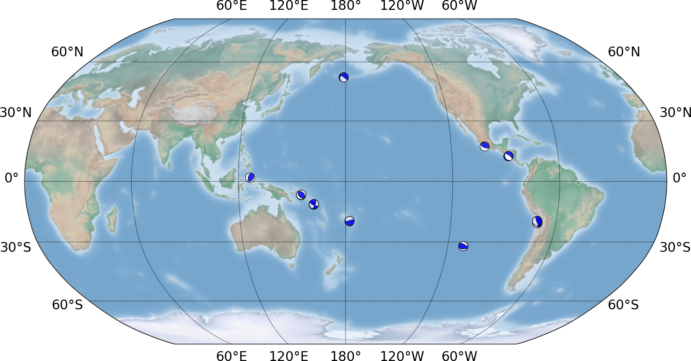

The created event-catalog can be updated for all events with magnitude more than 6.0:

::

    obspyDMT --datapath neic_events_2014_dir --min_date 2014-01-01 --max_date 2015-01-01 --min_mag 6.0 --event_catalog NEIC_USGS --event_info

and again to plot the event information in the local data-set:

::

    obspyDMT --datapath neic_events_2014_dir --local --plot_ev --plot_focal --min_date 2014-01-01

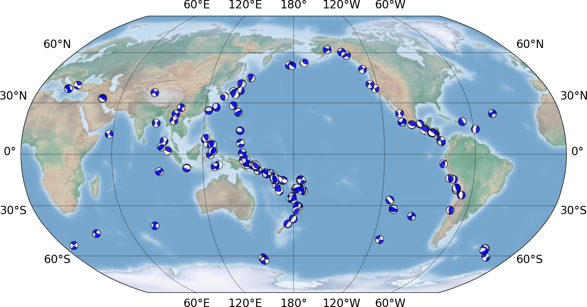

To plot the seismicity map for all events in NEIC with magnitude more than 5.0:

::

    obspyDMT --datapath neic_events_dir --min_date 1976-01-01 --max_date 2015-01-01 --min_mag 5.0 --event_catalog NEIC_USGS --event_info --plot_seismicity

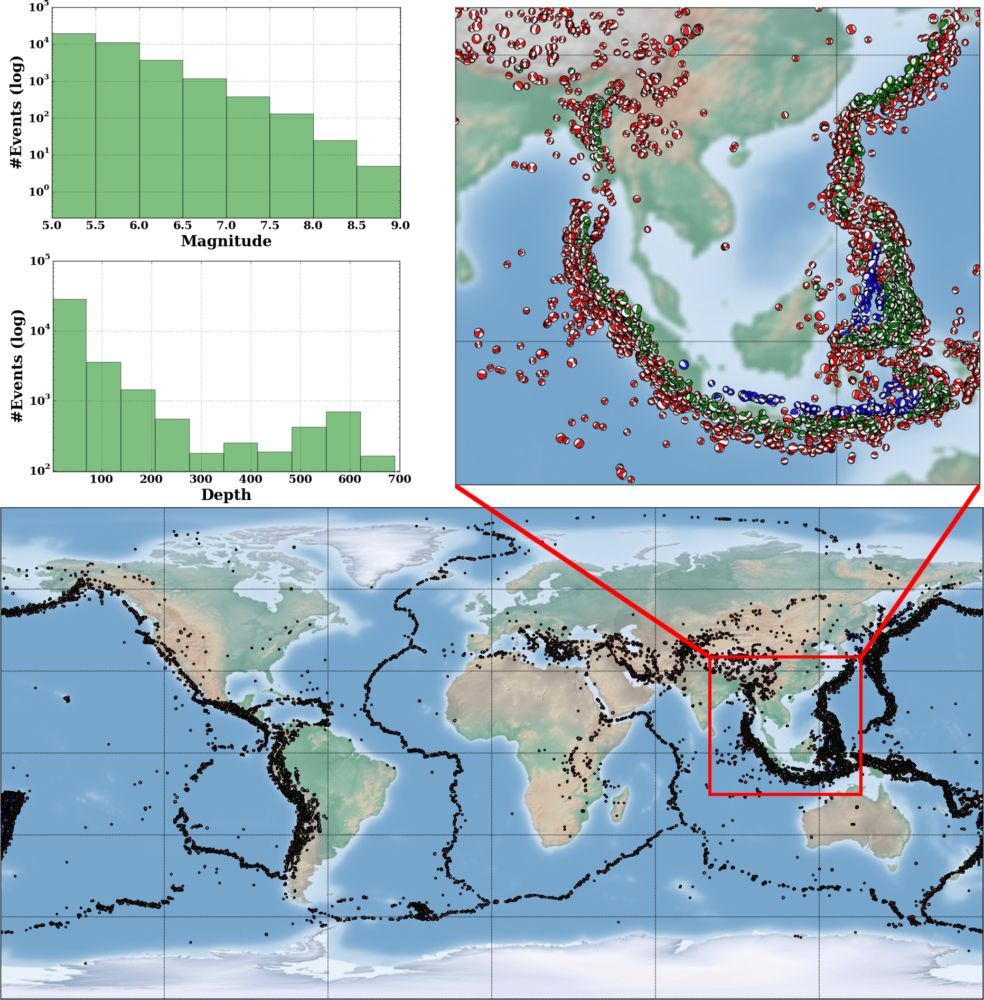

----------------
event_based mode
----------------

All BHZ and HHZ channels from GFZ data-center:

::

    obspyDMT --datapath event_based_dir --min_date 2014-01-01 --max_date 2015-01-01 --min_mag 7.0 --event_catalog NEIC_USGS --data_source "GFZ" --cha "BHZ,HHZ" --preset 300 --offset 3600

To plot the ray coverage:

::

    obspyDMT --datapath event_based_dir --local --plot_ev --plot_focal --plot_sta --plot_ray --min_date 2014-01-01

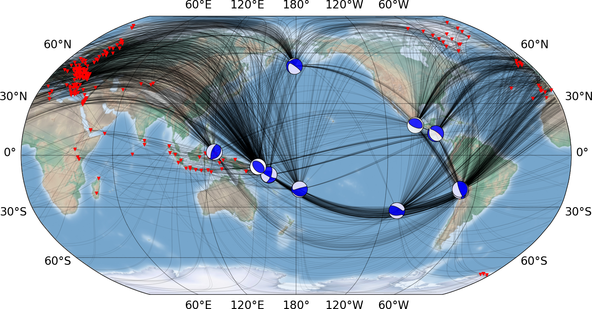

It is possible to update the above data-set with other event/stations:

::

    obspyDMT --datapath event_based_dir --data_source "GEONET" --cha "BHZ,HHZ" --preset 300 --offset 3600

.. image:: figures/gfz_geonet_event_based.png
   :scale: 75%
   :align: center

In fact, it could have been also possible to request GFZ and GEONET at the same time:

::

    obspyDMT --datapath event_based_dir --min_date 2014-01-01 --max_date 2015-01-01 --min_mag 7.0 --event_catalog NEIC_USGS --data_source "GFZ,GEONET" --cha "BHZ,HHZ" --preset 300 --offset 3600

Similarly, it is possible to update the data-set for TA network and * stations: (--data_source is omitted as IRIS is the default data source, i.e. --data_source IRIS would give the same result)

::

    obspyDMT --datapath event_based_dir --net TA --cha "BHZ,HHZ" --preset 300 --offset 3600

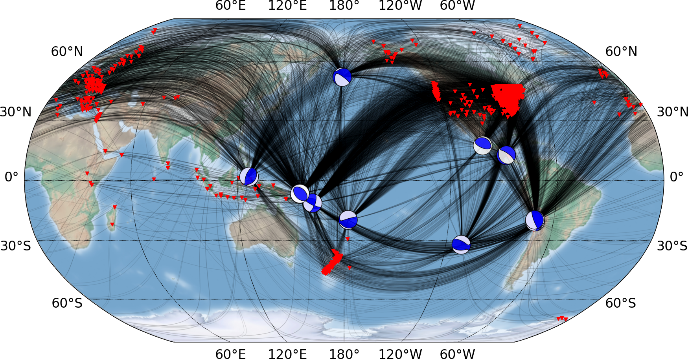

To create KML file:

::

    obspyDMT --datapath event_based_dir --local --plot_ev --plot_focal --plot_sta --plot_ray  --create_kml --min_date 2014-01-01

.. image:: figures/google_earth_us.jpg
   :scale: 75%
   :align: center

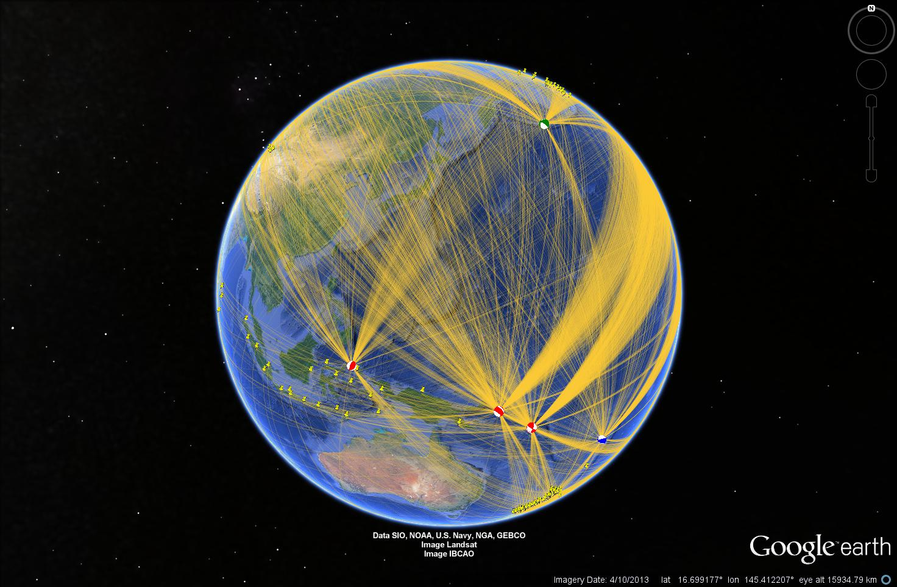

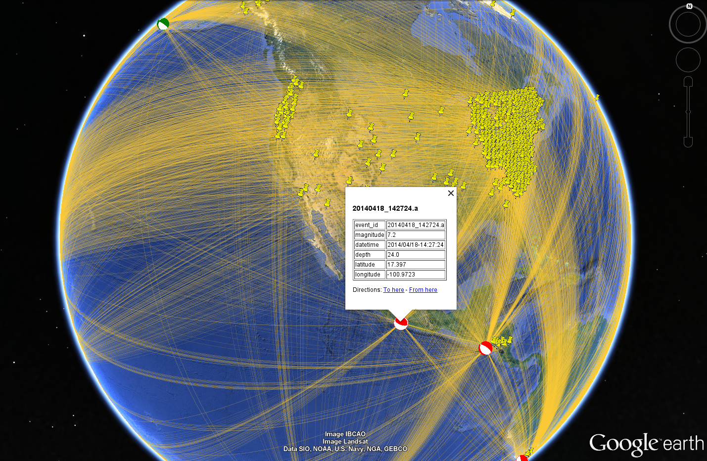

---------------
continuous mode
---------------

::

    obspyDMT --datapath continuous_dir --min_date 2014-01-01 --max_date 2014-02-01 --net TA --sta "1*" --cha BHZ --continuous

.. image:: figures/continuous_example.png
   :scale: 75%
   :align: center

----------
processing
----------

Processing of the data set using default or user defined processing function; user can customize the processing unit by writing a script in obspy, SAC and/or any other processing tool on the waveform level; Application to the whole data set directly after data-retrieval or as a separate step. Support for parallelized processing.

Only apply instrument correction:

::

    obspyDMT --datapath lmu_process_dir --min_date 2014-01-01 --max_date 2015-01-01 --min_mag 8.0 --event_catalog NEIC_USGS --data_source "LMU" --cha "BHZ,HHZ" --preset 300 --offset 3600 --instrument_correction

::

    obspyDMT --datapath lmu_process_dir --local --plot --plot_waveform --min_date 2014-01-01

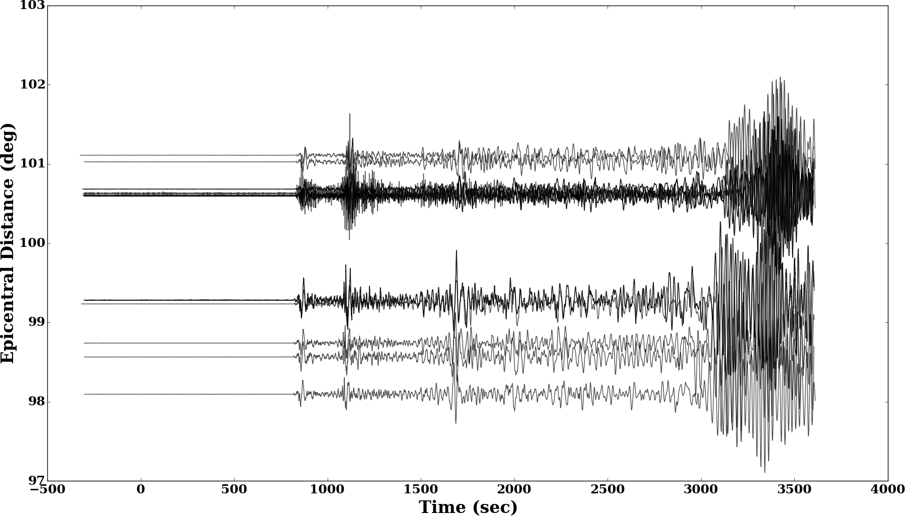

::

    obspyDMT --datapath lmu_process_dir --local --plot --plot_waveform --plot_dir_name processed --min_date 2014-01-01

.. .. image:: figures/lmu_processed.png
..    :scale: 75%
..    :align: center

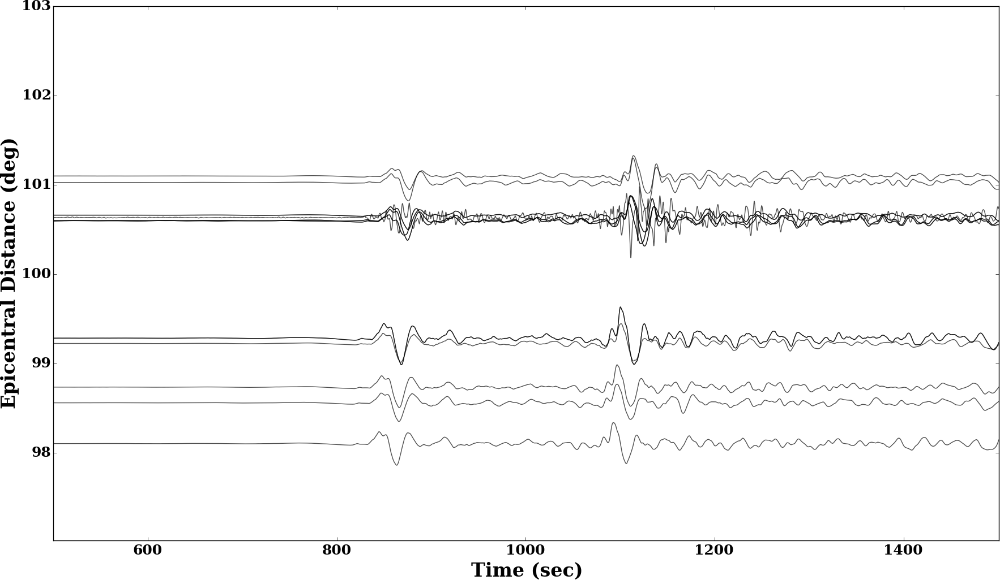

Resample the already archived waveforms to (1Hz) and apply instrument correction:

::

    obspyDMT --datapath lmu_process_dir --local --instrument_correction --sampling_rate 1. --force_process

we need --force_process since we have already processed the data in the previous step.

.. .. image:: figures/lmu_resampled.png
..    :scale: 75%
..    :align: center

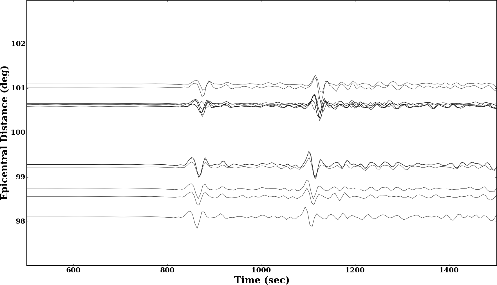

----------------------------------
Parallel retrieving and processing
----------------------------------

enable parallel waveform/response request with X threads.
::

    --req_parallel --req_np X

enable parallel processing with X threads.
::

    --parallel_process --process_np X

using the bulkdataselect web service. Since this method returns multiple channels of time series data for specified time ranges in one request, it speeds up the waveform retrieving.
::

    --bulk

-----------------------
Explore stationXML file
-----------------------

::

    obspyDMT --datapath /path/to/STXML.IC.XAN.00.BHZ --plot_stationxml --plotxml_paz --plotxml_min_freq 0.0001

.. image:: figures/IC.XAN.00.BHZ.png
   :scale: 75%
   :align: center

::

    obspyDMT --datapath /path/to/STXML.GT.LBTB.00.BHZ --plot_stationxml --plotxml_paz --plotxml_min_freq 0.0001

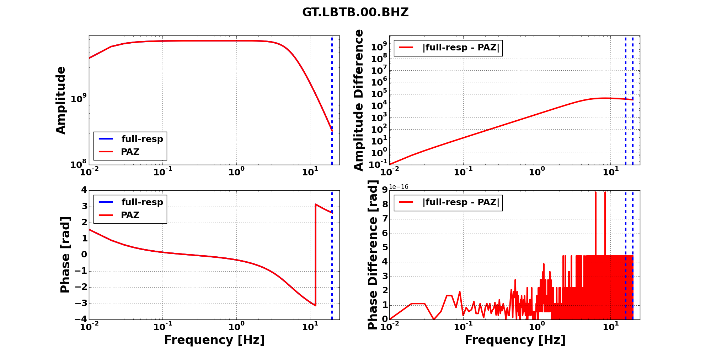
::

    obspyDMT --datapath /path/to/STXML.GT.LBTB.00.BHZ --plot_stationxml --plotxml_min_freq 0.0001 --plotxml_allstages

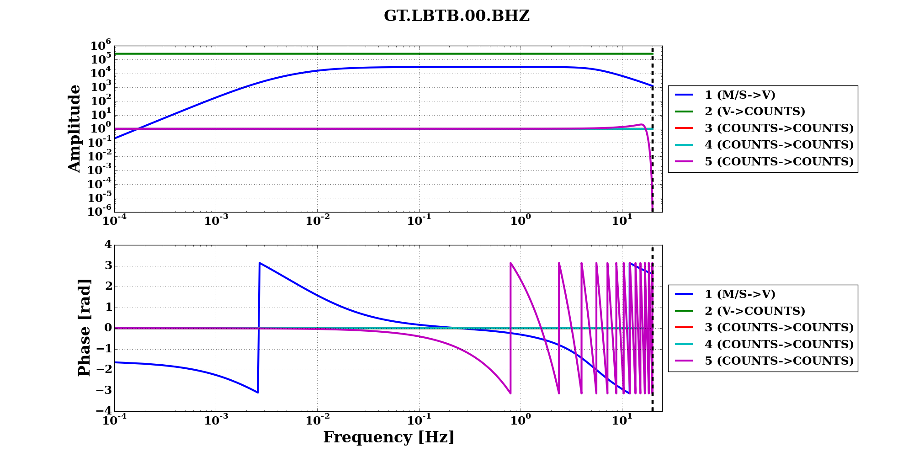

-------------------
Directory structure
-------------------

obspyDMT organizes the data in a simple and efficient way. For each request, it creates a parent directory at *datapath* and arranges the retrieved data either in different event directories (*event-based request*) or in chronologically named directories (*continuous request*). It also creates a directory in which a catalog of all requested events/time spans are stored. Raw waveforms, StationXML/response files and corrected waveforms are collected in sub-directories. While retrieving the data, obspyDMT creates metadata files such as station/event location files, and they are all stored in *info* directory of each event.

.. image:: figures/dmt_dir_structure.png
   :scale: 80%
   :align: center
