========================================================================================
obspyDMT: A Python Toolbox for Retrieving and Processing of Large Seismological Datasets
========================================================================================

Welcome to obspyDMT version 1.0.0 tutorial!

obspyDMT_ (obspy Data Management Tool) is a command line tool for retrieving, processing and management of large seismological datasets in a fully automatic way which can be run in serial or in parallel.

This tool is developed mainly to address the following tasks automatically:

1. Retrieval of waveforms (MSEED or SAC), stationXML/response files and metadata from FDSN and ArcLink archives. This could be done in *serial* or in *parallel* for single or large requests.
2. Supports both event-based and continuous requests.
3. Extracting the information of all the events via user-defined options (time span, magnitude, depth and event location) from IRIS, NEIC and GCMT. Therefore, moment tensor information can also be retrieved.
4. Updating existing archives (waveforms, stationXML/response files and metadata).
5. Processing the data in *serial* or in *parallel* (e.g. *removing the trends and means of the time series, tapering, filtering and Instrument correction*).
6. Management of large seismological datasets.
7. Plotting tools (events and/or station locations, ray coverage (event-station pair), epicentral-distance plots for all archived waveforms and seismicity maps). In case that the moment tensor information is retrieved, it is also possible to plot the beachballs at the location of events.
8. Exploring stationXML files by plotting the instrument response for all stages and/or for each stage.

This tutorial has been divided into the following sections: 

1.  `How to cite obspyDMT`_
2.  `Lets get started`_: install obspyDMT and check your local machine for required dependencies.
3.  `Quick tour`_: run a quick tour.
4.  `Option types`_: there are two types of options in obspyDMT: *option-1* (with value) and *option-2* (without value)
5.  `event-info request`_: if you are looking for some events and you want to get info about them without downloading waveforms.
6.  `event-based request`_: retrieve the waveforms, stationXML/response files and meta-data of all the requested stations for all the events found in the archive.
7.  `continuous request`_: retrieve the waveforms, stationXML/response files and meta-data of all the requested stations and for the requested time span.
8.  `Update`_: if you want to continue an interrupted request or complete your existing archive.
9.  `Geographical restriction`_: if you want to work with the events happened in a specific geographical coordinate and/or retrieving the data from the stations in a specific circular or rectangular bounding area.
10. `Instrument correction`_: applying instrument correction to raw counts using stationXML/response files.
11. `Parallel retrieving and processing`_: send the requests and/or process the data in parallel. This section introduces some options (*bulk* and *parallel retrieving and processing*) to speed-up the whole procedure.
12. `Plot`_: for an existing archive, you can plot all the events and/or all the stations, ray path for event-station pairs and epicentral-distance/time for the waveforms using GMT-5 or basemap tools.
13. `Explore stationXML file`_: how to explore and analyze different stages available in a stationXML file.
14. `Seismicity`_: plot the geographical and historical distribution of earthquake activities (seismicity).
15. `NEIC and GCMT`_: retrieving event information including moment tensor from NEIC or GCMT.
16. `Folder structure`_: the way that obspyDMT organizes your retrieved and processed data in the file-based mode.
17. `Available options`_: all options currently available in obspyDMT.
18. `Algorithm`_: flow chart of the main steps in each obspyDMT mode.
19. `Example: RHUM-RUM stations`_: exclusively for RHUM-RUM users.

--------------------
How to cite obspyDMT
--------------------

If you use obspyDMT, please consider citing the code as:

::

    Kasra Hosseini (2015), obspyDMT (Version 1.0.0) [software] [https://github.com/kasra-hosseini/obspyDMT]

We have also published a paper in SRL (Seismological Research Letters) for obspyDMT's predecessor that we kindly ask you to cite in case that you found obspyDMT useful for your research:

::

    C. Scheingraber, K. Hosseini, R. Barsch, and K. Sigloch (2013), ObsPyLoad - a tool for fully automated retrieval of seismological waveform data, Seismological Research Letters, 84(3), 525-531, DOI:10.1785/0220120103.

-----------------
Lets get started
-----------------

Once a working Python and ObsPy_ environment are installed,
obspyDMT can be installed in different ways:

**1. install obspyDMT package locally:** One simple way to install obspyDMT
is via PyPi:

::

    pip install obspyDMT

**2. install obspyDMT from the source code**: the latest version of obspyDMT
is available on GitHub. After installing git on your machine:

::
    
    $ git clone https://github.com/kasra-hosseini/obspyDMT.git /path/to/my/obspyDMT
    $ cd /path/to/my/obspyDMT
    $ pip install -v -e .

Alternatively:

::
    
    $ git clone https://github.com/kasra-hosseini/obspyDMT.git /path/to/my/obspyDMT
    $ cd /path/to/my/obspyDMT
    $ python setup.py install

**3. running from the source code:** in case that none of the above methods
worked for you, the source code could be downloaded directly from GitHub_
website and you can either work with the source code or install it:

::
    
    $ cd /path/to/my/obspyDMT
    $ python setup.py install

obspyDMT can be used from a system shell without explicitly calling the *Python* interpreter. It contains various options for customizing the request. Each option has a reasonable default value and the user can change them to adjust obspyDMT options to a specific request. The following command gives all the available options with their default values:

::

    $ obspyDMT --help

As you can see, there are lots of available options (not necessarily required for your work) and it is difficult to explore them. An alternative to this is to list option groups by:

::

    $ obspyDMT --options
    
And to know the available options in each group: (in this example, we are interested in option group number 2 [Path specification])

::

    $ obspyDMT --list_option 2

To check the dependencies required for running the code properly:

::

    $ obspyDMT --check

**ATTENTION:** if obspyDMT is installed on your machine, it can be easily run from everywhere. However, if you want to use the source code instead:

::

    $ cd /path/to/my/obspyDMT.py
    $ ./obspyDMT.py --check

In all the following examples, we assume that obspyDMT is already installed.

----------
Quick tour
----------

To run a quick tour, it is enough to:

::

    $ obspyDMT --tour

*dmt-tour-data* directory will be created in the current path and the retrieved/processed data will be organized there. (Please refer to `Folder structure`_ section for more information)

To have an overview on the retrieved raw counts, the waveforms can be plotted by:

::

    $ obspyDMT --plot_dir 'dmt-tour-data' --min_date 2011-01-01 --plot_epi

**command:** *--plot_dir* specifies the address, *--min_date* filters the
event datetime (in this case, we only have one event) and *--plot_epi* changes
the mode of the plotting to epicentral-time plot.

.. image:: figures/epi_time_20110311_1_raw.png
   :scale: 60%
   :align: center

for plotting the corrected waveforms:

::

    $ obspyDMT --plot_dir 'dmt-tour-data' --min_date 2011-01-01 --plot_epi --plot_type corrected

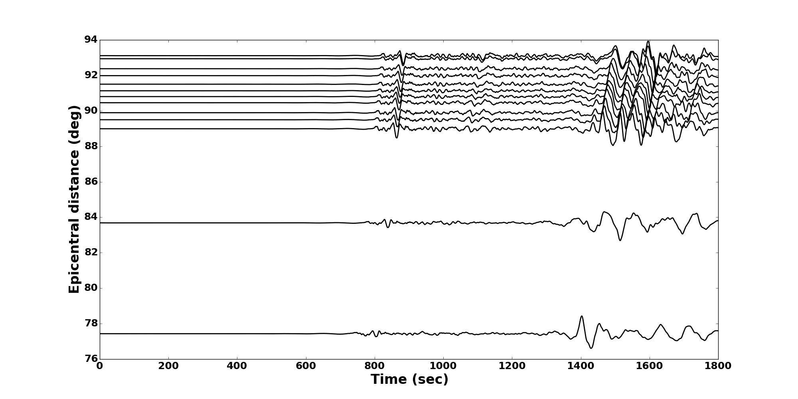

obspyDMT plots the ray coverage (ray path between each source-receiver pair) by:

::

    $ obspyDMT --plot_dir 'dmt-tour-data' --min_date 2011-01-01 --plot_ray --plot_sta --plot_ev
   
**command:** *--plot_ray*, *--plot_sta* and *--plot_ev* mean that ray, stations and events should be plotted respectively.

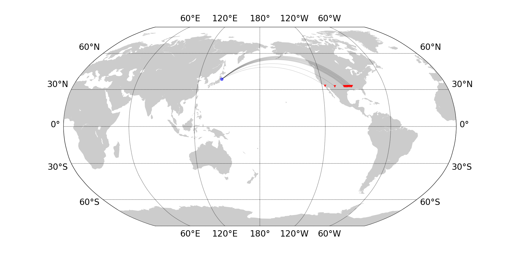

**ATTENTION:** when you run the plotting tools, obspyDMT asks for the type
of map which can be Bluemarble, Etopo, Shaderelief and Simple.

It is also possible to change the map projection in the pop-up menu (with the same command line as above):

::

    $ obspyDMT --plot_dir 'dmt-tour-data' --min_date 2011-01-01 --plot_ray --plot_sta --plot_ev

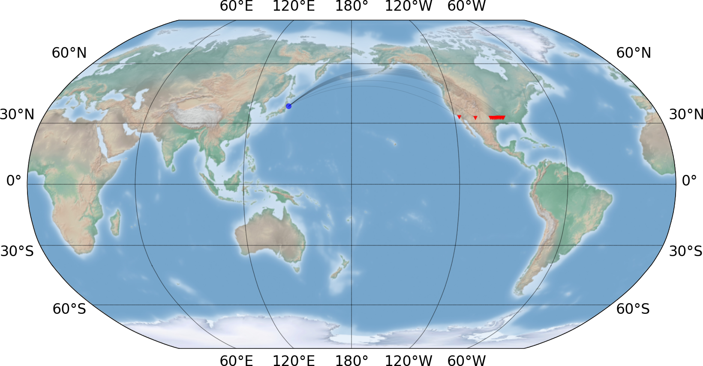

------------
Option types
------------

There are two types of options in obspyDMT: option-1 (with value) and option-2 (without value). In the first type, user should provide value which will be stored and will be used in the program as input. However, by adding type-2 options, which does not require any value, one feature will be activated or deactivated (e.g. if you enter '--check', refer to `Lets get started`_ section, the program will check all the dependencies required for running the code properly).

The general form to enter the input (i.e. change the default values) is as follow:

::

    $ obspyDMT --option-1 'value' --option-2

To show all the available options with short descriptions:

::

    $ obspyDMT --help 

.. or refer to the `Available options`_ section in this tutorial in which the options marked with '*' are the first option type (option-1), and the options marked with '**' are the second type (option-2).

The options specified by *--option=OPTION* are type-1 (with value) and *--option* are type-2 (without value).

**ONE GOOD THING:** the order of options is commutative!

Another way to differentiate between option-1 and option-2 is to: (here, we only look at option group number 3)

::

    $ obspyDMT --list_option 3

The third column is either: string (option-1 type) or None (option-2 type)

------------------
event-info request
------------------

In this type of request, obspyDMT will search for all the available events based on the options specified by the user, print the results and create an event catalog without retrieving waveforms or stationXML/response files.

The following lines show how to send an *event-info request* followed by some examples.

The general way to define an *event-info request* is:

::

    $ obspyDMT --event_info --option-1 'value' --option-2

The *--event_info* flag forces the code to just retrieve the event information and create an event catalog.
For details on *option-1* and *option-2* please refer to `Option types`_ section.

**Example 1:** requesting all the events with *6.6 <= magnitude <= 8.0* that happened in the time period of: 2013-05-01 until 2014-01-01:

::

    $ obspyDMT --datapath event_info_example --event_info --min_mag 6.6 --max_mag 8.0 --min_date 2013-05-01 --max_date 2014-01-01

**command:** *--datapath* is an option to specify the directory in which the data will be stored, *--event_info* determines that obspyDMT_ should just search for the event information and do not retrieve any seismic data (waveforms, stationxml files and metadata) and the other options *--min_mag*, *--max_mag*, *--min_date*, *--max_date* specify the minimum/maximum magnitude, minimum and maximum date.

When the job starts, a folder will be created with the address specified by *--datapath* flag (by default: *obspyDMT-data* in the current directory). To access the event information for this example, go to:

::

    cd ./event_info_example/2013-05-01_2014-01-01/EVENTS-INFO

and check the *catalog_table.txt* and *catalog.txt* text files or *catalog.ml* which is in QuakeML format (Please refer to `Folder structure`_ section for more information).

**ATTENTION:** In the above example, we did not change the *--event_catalog*. Therefore, obspyDMT uses the default catalog: *IRIS*.

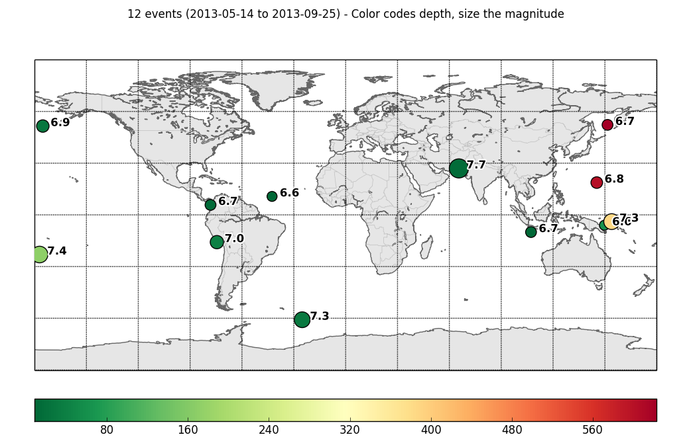

-------------------
event-based request
-------------------

In this type of request, the following steps will be done automatically:

1. Search for all available events based on the options specified by the user.
2. Check the availability of the requested stations for each event.
3. Start to retrieve the waveforms and/or stationXML/response files for each event and for all available stations. (default: waveforms, stationXML/response files and metadata will be retrieved.)
4. Applying instrument correction to all saved waveforms based on the specified options.

Retrieving and processing could be done in **serial** or in **parallel**.

The following lines show how to send an *event-based request* with obspyDMT followed by some short examples.

The general way to define an *event-based request* is:

::

    $ obspyDMT --option-1 'value' --option-2

For details on *option-1* and *option-2* please refer to `Option types`_ section.

**Example 1:** the following command shows how to get all the waveforms,
stationXML/response files and metadata of *BHZ* channels available in *II*
network with station names start with *A* or *B* for the great Tohoku-oki
earthquake of magnitude Mw 9.0:

::

    $ obspyDMT --min_mag 8.9 --min_date 2011-03-01 --max_date 2011-03-30 --net II --sta A*,B* --cha BHZ --offset 3600

**command:** *--min_mag*, *--min_date* and *max_date* specify the minimum
magnitude, start and end datetime parameters for event search.
*--net*, *--sta* and *--cha* change the network to II, stations to A* or B*
and channel to BHZ.
*--offset* changes the required length for waveforms after the event time to 3600sec (default: 1800sec).

We can look at the event and station distributions for this request by:

::

    $ obspyDMT --plot_dir obspyDMT-data/2011-03-01_2011-03-30 --min_date 2011-01-01 --plot_ray --plot_sta --plot_ev

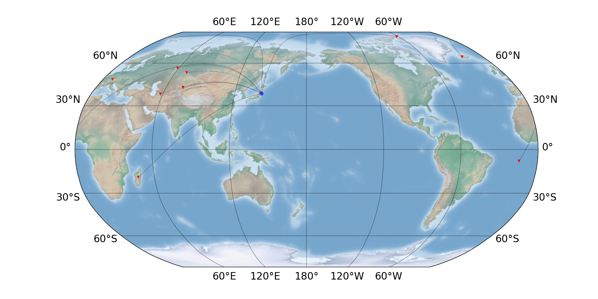

**Example 2:** By default, obspyDMT saves the waveforms in *SAC* format. In this case, it will fill in the station location (stla and stlo), station elevation (stel), station depth (stdp), event location (evla and evlo), event depth (evdp) and event magnitude (mag) in the SAC headers. However, if the desired format is *MSEED*: (for downloading the same event and station identity as *Example 1*)

::

    $ obspyDMT --min_mag 8.9 --min_date 2011-03-01 --max_date 2011-03-30 --net II --sta A*,B* --cha BHZ --offset 3600 --mseed

**Example 3:** for downloading just the raw waveforms without stationXML/response file and instrument correction:

::

    $ obspyDMT --min_mag 8.9 --min_date 2011-03-01 --max_date 2011-03-30 --net II --sta A*,B* --cha BHZ --offset 3600 --mseed --response 'N' --ic_no

**Example 4:** the default values for the preset (how close the time series (waveform) will be cropped before the origin time of the event) and the offset (how close the time series (waveform) will be cropped after the origin time of the event) are 0 and 1800 seconds. You can change them by adding the following flags:

::

    $ obspyDMT --preset time_before --offset time_after --option-1 value --option-2 

**Example 5:** to retrieve all the *GSN* stations (BHZ channel) for the events with magnitude more than 6.0 that occured from 2014-01-01 to 2014-03-01 (or 2014-02-28-23-59-59):

::

    $ obspyDMT --datapath gsn_example --min_date 2014-01-01 --max_date 2014-03-01 --min_mag 6.0 --net _GSN --cha BHZ --req_parallel --req_np 10

**ATTENTION:** *_GSN* is GSN virtual network.

To check all the retrieved stations:

::

    $ obspyDMT --plot_dir gsn_example --min_date 2014-01-01 --plot_ray --plot_sta --plot_ev

.. image:: figures/event_based_ex5.png
   :scale: 75%
   :align: center

------------------
continuous request
------------------

In this type of request, the following steps will be done automatically:

1. Get the time span from input and in case of large time spans, divide it into smaller intervals.
2. Check the availability of the requested stations for each interval.
3. Start to retrieve the waveforms and/or stationXML/response files for each interval and for all the available stations. (default: waveforms, stationXML/response files and metadata will be retrieved.)
4. Applying instrument correction to all saved waveforms based on the specified options.
5. Merging the retrieved waveforms for all time intervals to get a waveform with the original requested time span and save the final product.

The following lines show how to send a *continuous request* with obspyDMT followed by some short examples.

The general way to define a *continuous request* is:

::

    $ obspyDMT --continuous --option-1 value --option-2

For details on *option-1* and *option-2* please refer to `Option types`_ section.

**Example 1:** the following command line shows how to get all the waveforms, stationXML/response files and metadata of the *BHZ* channels available in *TA* network with station names start with *Z* for the specified time span:

::

    $ obspyDMT --continuous --min_date '2011-01-01' --max_date '2011-01-03' --net TA --sta Z* --cha BHZ

**WARNING:** it is possible that this request takes a long time on your machine (depends on your internet connection). If this is the case, you can send parallel requests:

::

    $ obspyDMT --continuous --min_date '2011-01-01' --max_date '2011-01-03' --net TA --sta Z* --cha BHZ --req_parallel --req_np 10

**Example 2:** By default, obspyDMT saves the waveforms in *SAC* format. In
this case, it will fill in the station location (stla and stlo), station
elevation (stel) and station depth (stdp) in the SAC headers.
However, if the desired format is *MSEED*: (for downloading the same time span
and station identity as *Example 1*)

::

    $ obspyDMT --continuous --min_date '2011-01-01' --max_date '2011-01-03' --net TA --sta Z* --cha BHZ --mseed

**Example 3:** for downloading just the raw waveforms without response file and instrument correction:

::

    $ obspyDMT --continuous --min_date '2011-01-01' --max_date '2011-01-03' --net TA --sta Z* --cha BHZ --mseed --response 'N' --ic_no

------
Update
------

If you want to continue an interrupted request or complete your existing archive, you can use the updating option. The general ways to update an existing folder (located in *address*) for FDSN stations or ArcLink stations:

::

    $ obspyDMT --fdsn_update 'address' --option-1 value --option-2
    $ obspyDMT --arc_update 'address' --option-1 value --option-2

Please note that all the commands presented in this section could be applied to `continuous request`_ by just adding *--continuous* flag to the command line (refer to the `continuous request`_ section).

**Example 1:** first, lets retrieve all the waveforms, stationXML/response files and metadata of *BHZ* channels available in *TA* network with station names start with *Z* for the great Tohoku-oki earthquake of magnitude Mw 9.0:

::

    $ obspyDMT --datapath test_update_option --min_mag 8.9 --min_date 2011-03-01 --max_date 2011-03-30 --net TA --sta Z* --cha BHZ

now, we want to update the folder for *BHE* channels:

::

    $ obspyDMT --fdsn_update test_update_option --net TA --sta Z* --cha BHE

To check all the retrieved stations:

::

    $ obspyDMT --plot_dir test_update_option --min_date 2011-01-01 --plot_ray --plot_sta --plot_ev

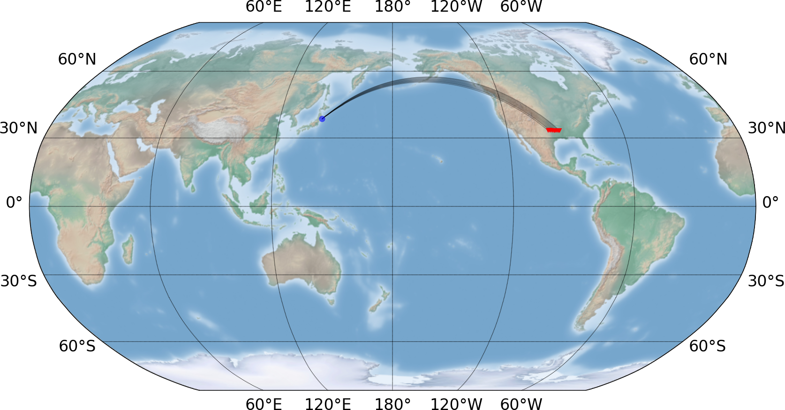

**we can send requests to other data-centers available in FDSN for both retrieving and updating.**

As an example, we want to update the directory for all available *BHZ*
channels in *GFZ* data-center:

::

    $ obspyDMT --fdsn_update test_update_option --cha BHZ --fdsn_base_url GFZ

**WARNING:** it is possible that this request takes a long time on your machine (depends on your internet connection). If this is the case, you can send parallel requests:

::

    $ obspyDMT --fdsn_update test_update_option --cha BHZ --fdsn_base_url GFZ --req_parallel --req_np 4

Another way to speed up the retrieving is to use: *--fdsn_bulk*

::

    $ obspyDMT --fdsn_update test_update_option --cha BHZ --fdsn_base_url GFZ --fdsn_bulk

To check all the retrieved stations:

::

    $ obspyDMT --plot_dir test_update_option --min_date 2011-01-01 --plot_ray --plot_sta --plot_ev

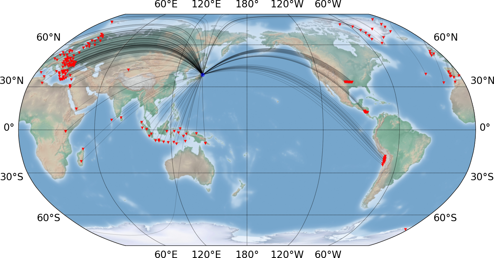

------------------------
Geographical restriction
------------------------

If you want to work with the events happened in a specific geographical coordinates and/or retrieving the data from the stations in a specific circular or rectangular bounding area, you are in the right section! Here, we have two examples:

**Example 1:** to extract the info of all the events occurred from 2000-01-01 until 2014-12-31 in a rectangular area (*lon1=44.38E* *lon2=63.41E* *lat1=24.21N* *lat2=40.01N*) with magnitude more than 3.0:

::

    $ obspyDMT --event_info --min_mag 3.0 --min_date 2000-01-01 --max_date 2014-12-31 --event_rect 44.38/63.41/24.21/40.01

**command:** *--event_info* changes the mode of obspyDMT to only retrieving the event information, *--event_rect* specifies a rectangular bounding area.

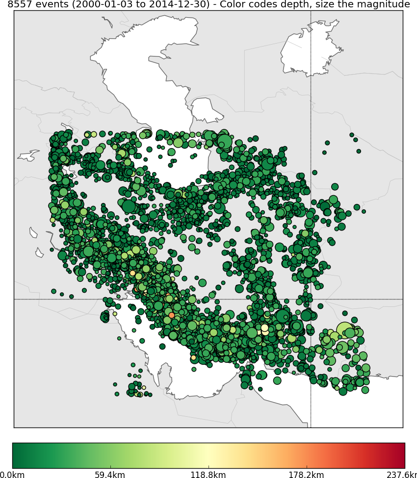

**Example 2:** to retrieve all the waveforms, stationXML/response files and metadata of *BHZ* channels available in a specific rectangular bounding area (*lon1=125.0W* *lon2=70.0W* *lat1=25N* *lat2=45N*) for the great Tohoku-oki earthquake of magnitude Mw 9.0, the command line will be:

::

    $ obspyDMT --datapath geo_restrict_ex2 --min_mag 8.9 --min_date 2011-03-01 --max_date 2011-03-31 --cha 'BHZ' --station_rect '-125.0/-70.0/25.0/45.0'

**WARNING:** it is possible that this request takes a long time on your machine (depends on your internet connection). If this is the case, you can send parallel requests:

::

    $ obspyDMT --datapath geo_restrict_ex2 --min_mag 8.9 --min_date 2011-03-01 --max_date 2011-03-31 --cha 'BHZ' --station_rect '-125.0/-70.0/25.0/45.0' --req_parallel --req_np 10

Alternatively, you can send bulk requests:

::

    $ obspyDMT --datapath geo_restrict_ex2 --min_mag 8.9 --min_date 2011-03-01 --max_date 2011-03-31 --cha 'BHZ' --station_rect '-125.0/-70.0/25.0/45.0' --fdsn_bulk

To check all the retrieved stations:

::

    $ obspyDMT --plot_dir geo_restrict_ex2 --min_date 2011-01-01 --plot_ray --plot_sta --plot_ev

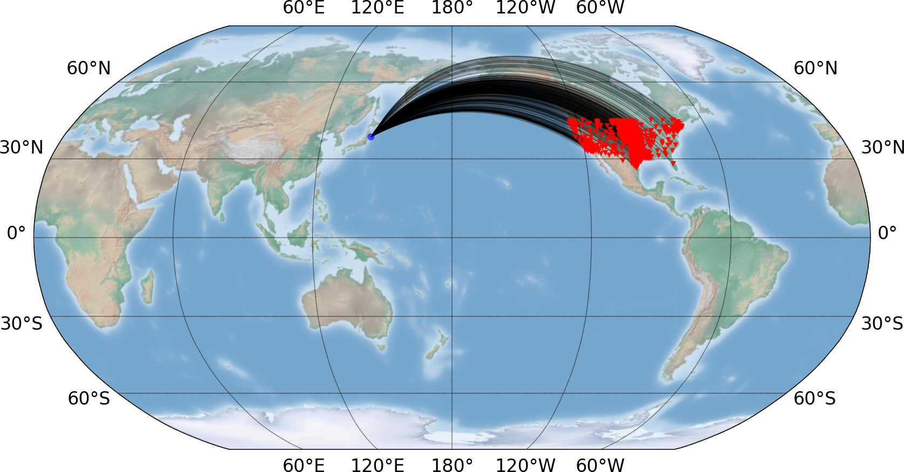

---------------------
Instrument correction
---------------------

When obspyDMT retrieves waveforms and their stationXML/response files, by
default it removes the trends and means of time series, tapers the waveforms,
filters and corrects them to the desired physical unit (displacement, velocity or acceleration). The default correction unit is Displacement and to change it into Velocity or Acceleration:

::

    $ obspyDMT --corr_unit 'VEL' --option-1 'value' --option-2
    $ obspyDMT --corr_unit 'ACC' --option-1 'value' --option-2

where *option-1* and *option-2* are the flags defined by the user (see `Option types`_ section).

You can deactivate the instrument correction by:

::

    $ obspyDMT --ic_no --option-1 value --option-2

Please note that all the commands presented in this section could be applied to `continuous request`_ by just adding *--continuous* flag to the command line (refer to `continuous request`_ section).

Before applying the instrument correction, a bandpass filter will be applied to the data with default values: *(0.008, 0.012, 3.0, 4.0)*. If you want to apply another band pass filter:

::

    $ obspyDMT --pre_filt '(f1,f2,f3,f4)' --option-1 value --option-2

where *(f1,f2,f3,f4)* are the four corner frequencies of a cosine taper: one between f2 and f3 and tapers to zero for f1 < f < f2 and f3 < f < f4.

If you do not need the pre filter:

::

    $ obspyDMT --pre_filt 'None' --option-1 value --option-2

In case that you want to apply instrument correction to an existing folder:

::

    $ obspyDMT --ic_all 'address' --corr_unit unit

here *address* is the path where your not-corrected waveforms are stored.
as mentioned above, *unit* is the unit that you want to correct the waveforms to. It could be *DIS* (default), *VEL* or *ACC*.

To make it clearer, let's take a look at an example with following steps:

**Step 1:** to retrieve all the waveforms, stationXML/response files and metadata of *BHZ* channels available in *TA* network with station names start with *Z* for the great Tohoku-oki earthquake of magnitude Mw 9.0: (please note that instrument correction will be applied to the retrieved waveforms by default)

::

    $ obspyDMT --datapath ic_ex1 --min_mag 8.9 --min_date 2011-03-01 --max_date 2011-03-30 --identity TA.Z*.*.BHZ

**Step 2:** now to correct the raw waveforms to velocity:

::

    $ obspyDMT --ic_all ic_ex1 --corr_unit 'VEL'

Sure enough, plotting the displacement seismograms:

::

    $ obspyDMT --plot_dir ic_ex1 --min_date 2011-01-01 --plot_epi --plot_type corrected

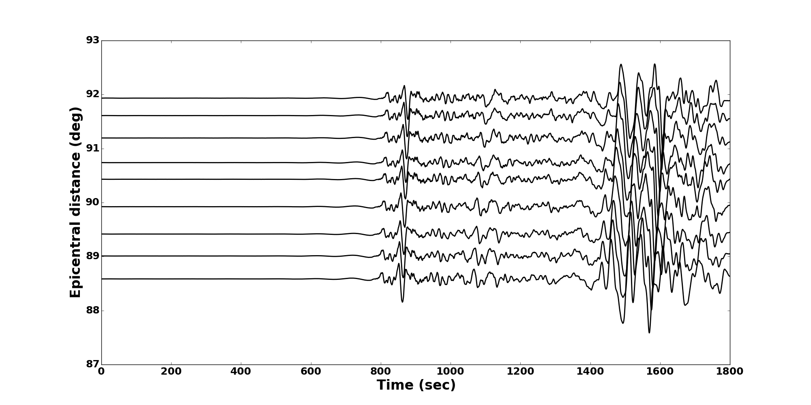

and plotting the velocity seismograms:

::

    $ obspyDMT --plot_dir ic_ex1 --min_date 2011-01-01 --plot_epi --plot_type corrected --corr_unit VEL

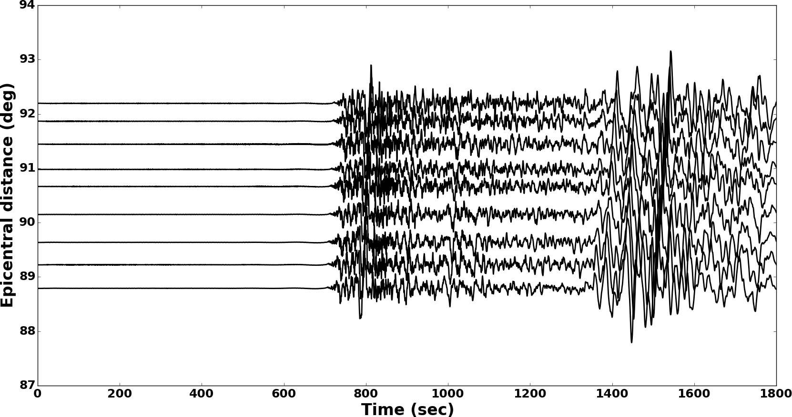

----------------------------------
Parallel retrieving and processing
----------------------------------

For each download request, obspyDMT uses ObsPy_ clients to establish connection to the data-centers, sends the request, downloads the data and disconnect. Some modifications can be applied to enhance the whole procedure:

**bulk request**

**bulk request** is a method provided by FDSN which gives access to multiple channels of *MSEED* data for specified time ranges, i.e. instead of sending the requests one by one, a list of requests can be sent.

obspyDMT incorporates this option and it can be activated by:

::

    $ obspyDMT --fdsn_bulk --option-1 'value' --option-2

**Parallel retrieving and processing**

Moreover, obspyDMT can send the requests in parallel which makes the whole procedure much more efficient. In this case, the requests (event-based or continuous) will be divided into the number of requested processes, each process sends the request to the data providers, retrieves and organizes the data. The general syntax for this option is:

::

    $ obspyDMT --req_parallel --req_np 10 --option-1 'value' --option-2

*--req_parallel* means that the request should be sent in parallel and *--req_np 10* specifies the number of requested processes which is *10* here.

obspyDMT can run the processing unit in parallel as well. In this mode, it divides the job into the number of requested processes and each of them performs the instrument correction or any other defined processes and stores the results. Syntax to activate this option is:

::

    $ obspyDMT --ic_parallel --ic_np 10 --option-1 'value' --option-2

*--ic_parallel* means that the processing should be done in parallel and *ic_np 10* specifies the number of requested processes which is *10* here.

----
Plot
----

For an existing archive, you can plot all the events and/or all the stations, ray path for event-station pairs and epicentral-distance/time for the waveforms.

The general syntax for plotting tools is: 

::

    $ obspyDMT --plot_dir 'address' [--plot_options]

that *--plot_options* could be *--plot_ev* for events, *--plot_sta* for stations, *--plot_se* for stations and events, *--plot_ray* for ray path between each event-station pairs and *--plot_epi* for epicentral-distance/time.

All the examples showed in this section are based on a database created by the following request:

::

    $ obspyDMT --datapath plot_ex --min_mag 8.9 --min_date 2011-03-01 --max_date 2011-03-30 --identity 'TA.Z*.*.BHZ'

**Example 1:** let's plot both stations and events available in the folder:

::

    $ obspyDMT --plot_dir plot_ex --min_date 2011-01-01 --plot_sta --plot_ev

the default format is *png*, but assume that we want *pdf* for our figures, then:

::

    $ obspyDMT --plot_dir plot_ex --min_date 2011-01-01 --plot_sta --plot_ev --plot_format 'pdf'

**Example 2:** in this example, we want to plot the ray path for event-station pairs but save the result in *$HOME/Desktop*:

::

    $ obspyDMT --plot_dir plot_ex --min_date 2011-01-01 --plot_ray --plot_sta --plot_ev --plot_save '/home/hosseini/Desktop'

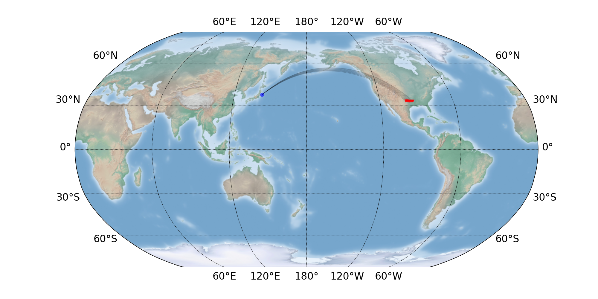

.. **Example 3:** now to the above example, we include the focal mechanism of the event (i.e. beachball should be plotted):
..
.. ::
..
..     $ obspyDMT --plot_dir plot_ex --min_date 2011-01-01 --plot_ray
.. --plot_sta --plot_ev --plot_focal
..
.. .. image:: figures/plot_sta_ev_ray_focal.png
..    :scale: 75%
..    :align: center

**Example 3:** obspyDMT supports GMT plots as well. For this reason, GMT5_ should be installed on your machine. In this example, we want to plot the ray path for event-station pairs (similat to *Example 3*) by using GMT5_:

::

    $ obspyDMT --plot_dir plot_ex --min_date 2011-01-01 --plot_ray_gmt

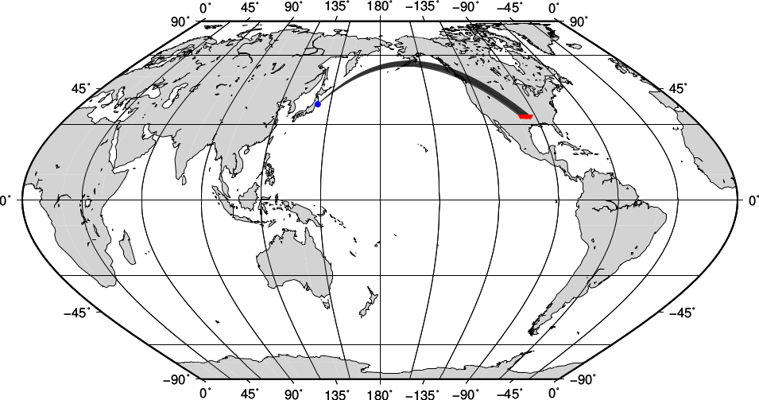

-----------------------
Explore stationXML file
-----------------------

stationXML files are retrieved from the data-providers in order to apply the instrument correction to the raw counts. Albeit convenient, it is usually difficult to explore the content of stationXML files. For this reason, obspyDMT has the functionality to plot the content of stationXML files. This has been shown in some examples (all the figures will be saved at ./stationxml_plots by default)

**Example 1:** plot the amplitude and phase components of a stationXML file that was retrieved in *Example 1* of `Update`_:

::

    $ obspyDMT --plotxml_dir path/to/STXML.TA.Z33A..BHZ --plotxml_paz

*--plotxml_dir* flag forces obspyDMT to generate a plot for amplitude and phase components of the StationXML file of TA.Z33A..BHZ station including all stages. *--plotxml_paz* extracts only PAZ, sensitivity and gain of the instrument response and plots the amplitude and phase components of that. Additionally, obspyDMT compares the results using L1 norm between full response and only PAZ information and plots the results.

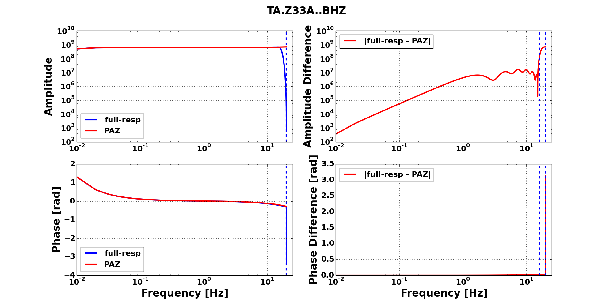

Moreover, it is possible to plot the stages of the stationXML file as well:

::

    $ obspyDMT --plotxml_dir path/to/STXML.TA.Z33A..BHZ --plotxml_paz --plotxml_allstages

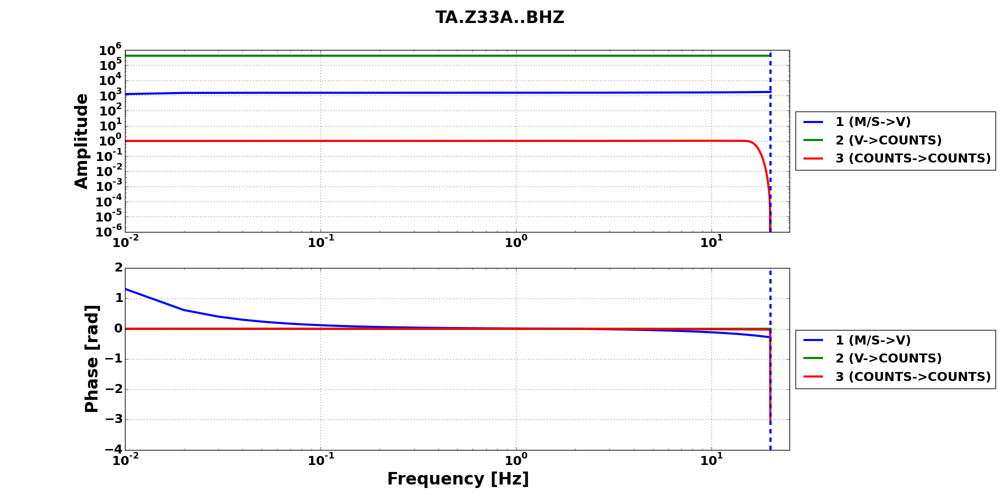

**Example 2:** minimum frequency in *Example 1* was 0.01Hz by default, this value can be changes by:

::

    $ obspyDMT --plotxml_dir path/to/STXML.TA.Z33A..BHZ --plotxml_paz --plotxml_min_freq 0.0001

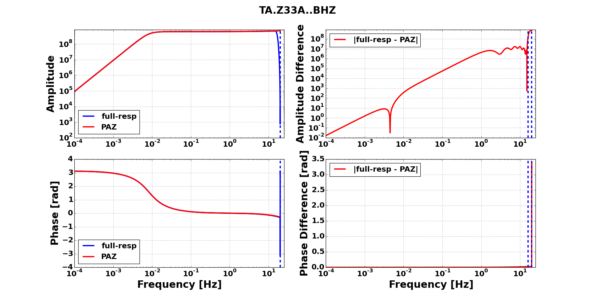

**Example 3:** in *Example 1* and *Example 2*, we only plot one stationXML file. It is possible to do the same for a directory of stationXML files. As an example, for GSN stations in *Example 5* of `event-based request`_:

::

    $ obspyDMT --plotxml_dir gsn_example/2014-01-01_2014-03-01/20140226_1/Resp --plotxml_paz

All the results will be stored at *./stationxml_plots*. As an example:

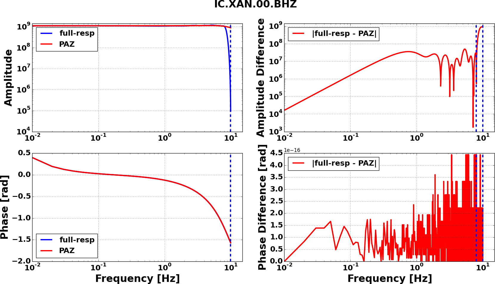

Moreover, a text file will be created: *report_stationxml* in the same directory (./stationxml_plots) that contains some information about the comparison between stationXML and PolesAndZeros with the following columns:

::

    channel_id  %(Phase)  Max Diff(abs)  Lat  Lon  Datetime  decimation delay  decimation correction

*channel_id* is the name of the channel with latitude (Lat) and longitude (Lon).
*Datetime* is the creation time for the StationXML file.
*decimation delay* is the delay time that has been caused by decimation stages.
*decimation correction* is the time that has been already corrected in the
instrument. The other parameters (*%(Phase)* and *Max Diff(abs)*) is
explained here:

The comparison between StationXML and PolesAndZeros is done as follow:

1. Phase responses of full StationXML file and only PAZ are extracted from stationXML file.
2. Based on *--plotxml_percentage flag (default 80)*, the phase response is cut from the lowest frequency (specified by *--plotxml_min_freq*) up to 80% (specified by --plotxml_percen) of its length (up to Nyquist frequency).
3. L1 norm between these cut phase responses is calculated.
4. The length of non-zero values are compared with the total length of the cut phase response and will be reported in *%(Phase)*. This shows the length of the cut phase response that differ between StationXML and only PolesAndZeros.
5. Maximum difference (absolute value) in L1 norm is reported in *%Max Diff(abs)*.

At this stage, we can plot the report (a simple Python script is provided at */path/to/obspyDMT/obspyDMT/utils/plotxml_report.py*):

::

    $ python plotxml_report.py /path/to/report_stationxml

which will create four figures.

First figure shows those stations in which there was no difference between
full stationXML and PAZ and/or the correction (decimation delay) has already
applied:

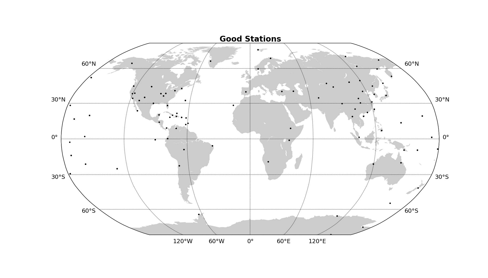

The second figure shows the time shift, i.e. decimation_delay - decimation_correction:

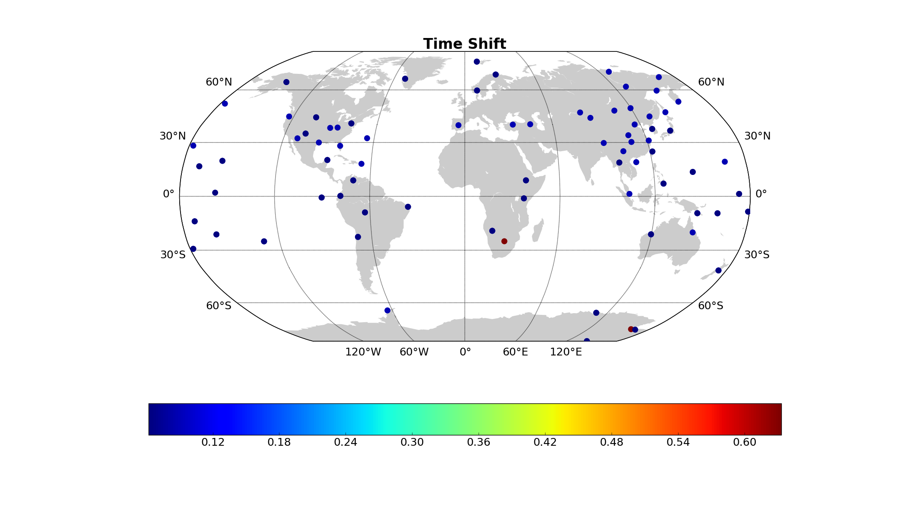

The third figure shows the difference percentage of "bad stations", i.e. full stationXML and PAZ were
different and the time shift (decimation_delay - decimation_correction)
was non-zero or decimation_delay was set to zero. For such stations, using
only PAZ will give different results compared to stationXML:

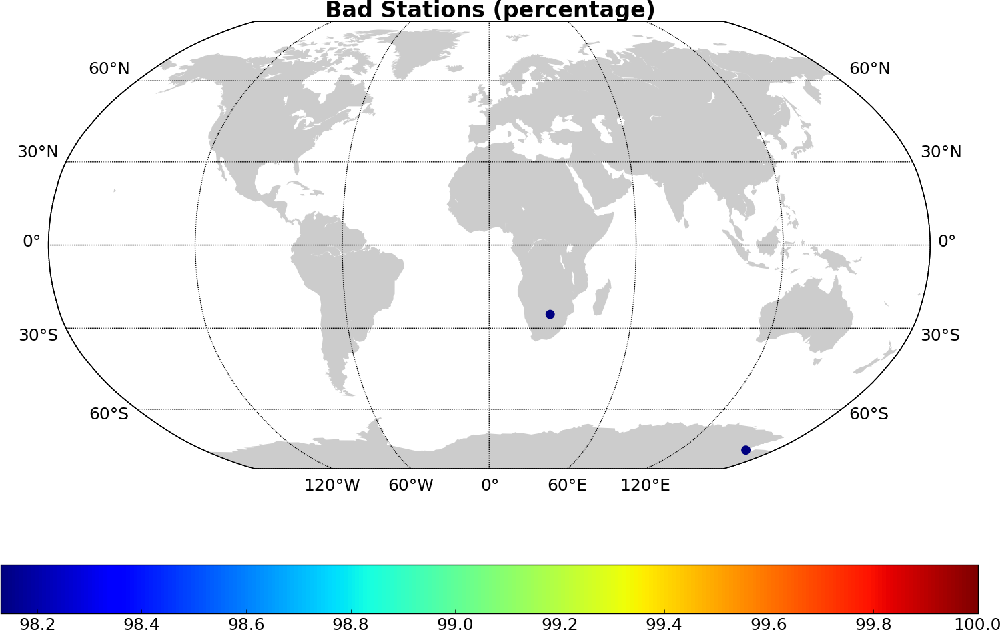

The fourth figure is similar to the third one, but the time shifts of "bad stations" are plotted:

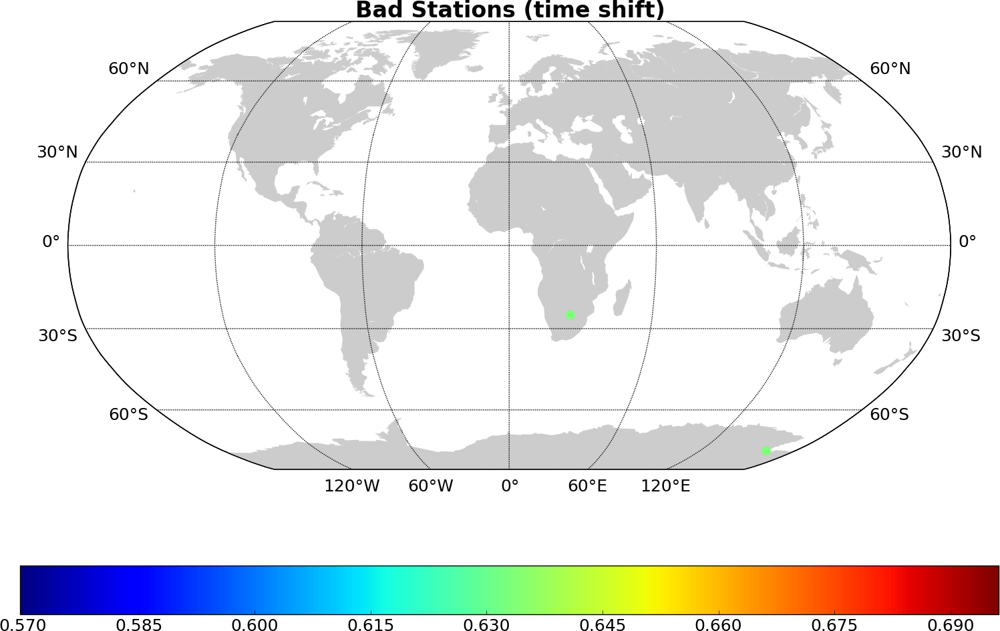

----------
Seismicity
----------

Geographical and historical distribution of earthquake activities (seismicity) can be plotted using *--seismicity* option in obspyDMT. In this mode, the software finds the events according to the input parameters and generates an image in which the events are categorized based on depth and magnitude.

**Example 1:** the command line to create *Japan* seismicity map from all the
events available in IRIS with magnitude more than 5.0 since 2000 is as follow:

::

    $ obspyDMT --datapath 'seismicity_japan' --seismicity --min_mag 5.0 --min_date 2000-01-01 --max_date 2014-12-31 --event_rect 120.0/155.0/25.0/55.0

*--datapath* is the address where the event catalog will be created, *--seismicity* enables the seismicity mode and *--min_mag*, *--min_date*, *--max_date* and *--event_rect* are event search parameters.

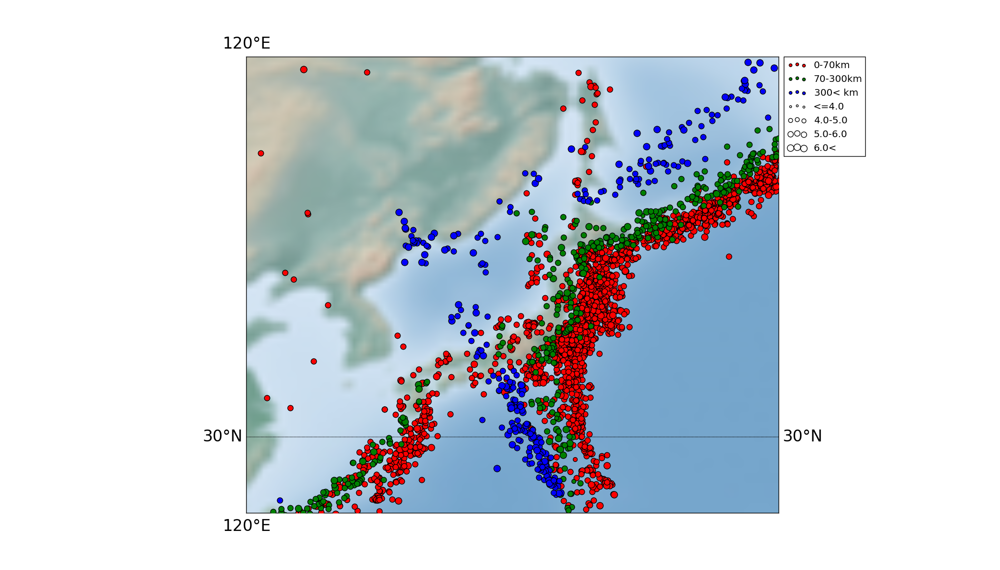

**Example 2:** the command line to create *global* seismicity map from all the
events available in IRIS archive with magnitude more than 5.0 since 2000 is as
follow: (27057 events)

::

    $ obspyDMT --datapath 'seismicity_glob' --seismicity --min_mag 5.0 --min_date 2000-01-01 --max_date 2014-12-31

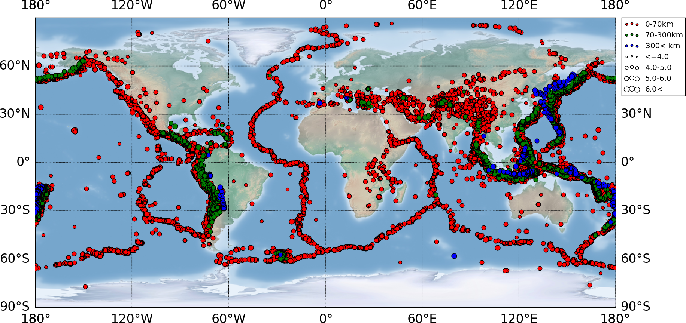

Distribution of events with depth:

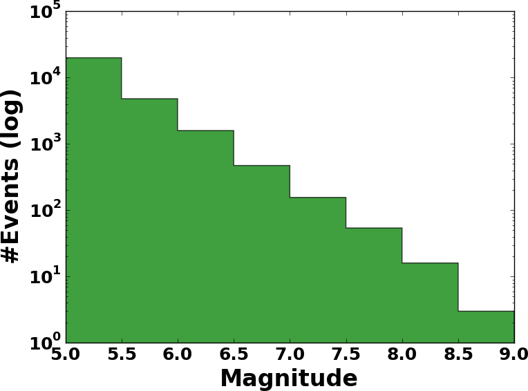

Distribution of events with magnitude:

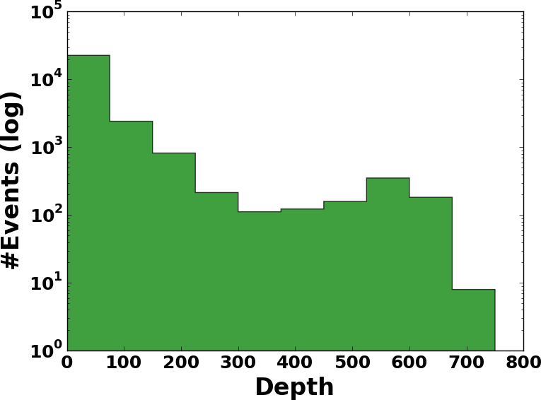

-------------
NEIC and GCMT
-------------

In addition to *IRIS* event web-service, obspyDMT can retrieve the event
information from NEIC and GCMT. This makes it possible to have moment tensor
of the events as well.

**NEIC**

This functionality needs mechanize_ python package to be installed. For this
reason, it is enough to:

::

    pip install mechanize

Otherwise, refer to mechanize_ to see how to install this package.

**Example 1** (similar to Example 1 in `event-based request`_)
the following command shows how to get all the waveforms,
stationXML/response files and metadata of *BHZ* channels available in *II*
network with station names start with *A* or *B* for the great Tohoku-oki
earthquake of magnitude Mw 9.0 from **NEIC** catalog:

::

    $ obspyDMT --datapath neic_ex1 --min_mag 8.9 --min_date 2011-03-01 --max_date 2011-03-30 --net II --sta A*,B* --cha BHZ --event_catalog NEIC_USGS

**command:**
*--datapath* is the address where the data will be stored.
*--min_mag*, *--min_date* and *max_date* specify the minimum
magnitude, start and end datetime parameters for event search.
*--net*, *--sta* and *--cha* change the network to II, stations to A* or B*
and channel to BHZ.
**--event_catalog** changes the default catalog (*IRIS*) to *NEIC*.

We can look at the event and station distributions for this request by:

::

    $ obspyDMT --plot_dir neic_ex1/2011-03-01_2011-03-30 --min_date 2011-01-01 --plot_ray --plot_sta --plot_ev --plot_focal

**Example 2** (similar to Example 2 in `Seismicity`_)
the command line to create *global* seismicity map from all the
events available in *NEIC* archive with magnitude more than 5.0 since 1976
is as follow:

::

    $ obspyDMT --datapath seismicity_glob_neic --seismicity --min_mag 5.0 --min_date 1976-01-01 --max_date 2014-12-31 --event_catalog NEIC_USGS

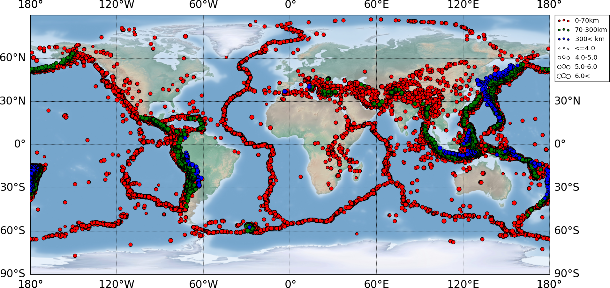

Since we can retrieve the moment tensor information from NEIC, it automatically generates the beach-ball map too:

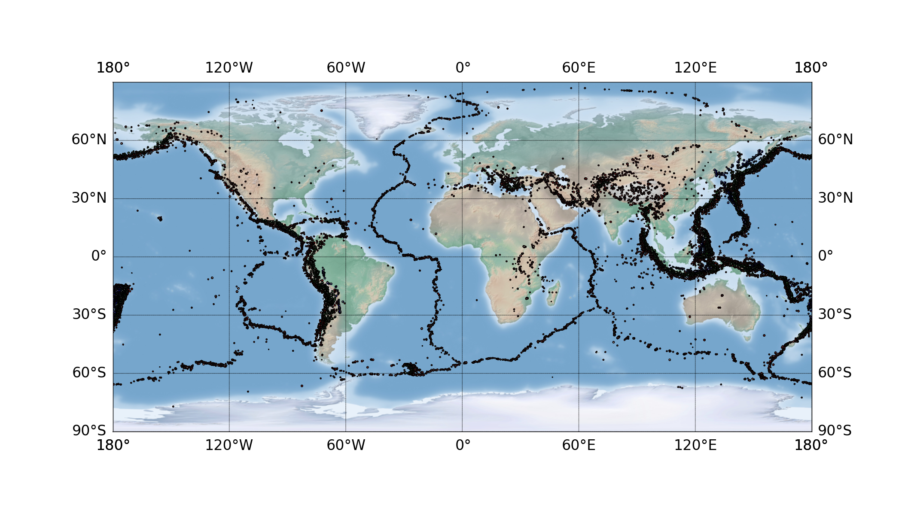

Histogram of event magnitudes:

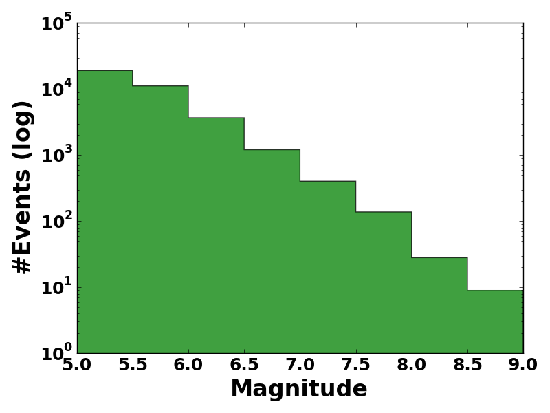

Histogram of event depths:

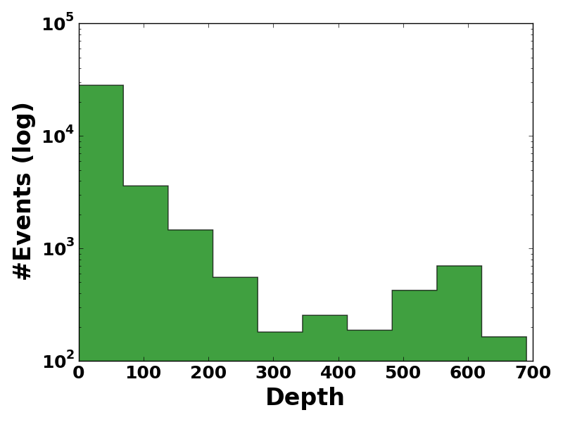

**GCMT**

**This functionality is currently available only for the latest version of obspy, and it does not work with version: 0.9.2**

**Example 3** obspyDMT can retrieve the event information (including moment tensor) from GCMT. Similar to *Example 1*, it is enough to:

::

    $ obspyDMT --datapath gcmt_ex2 --min_mag 8.9 --min_date 2011-03-01 --max_date 2011-03-30 --net II --sta A*,B* --cha BHZ --event_catalog GCMT_COMBO

**Example 4** the command line to create Japan seismicity map from all the events available in GCMT with magnitude more than 5.0 since 1976 is as follow:

::

    $ obspyDMT --datapath 'seismicity_japan_gcmt' --seismicity --min_mag 5.0 --min_date 1976-01-01 --max_date 2013-12-31 --event_rect 120.0/155.0/25.0/55.0 --event_catalog GCMT_COMBO

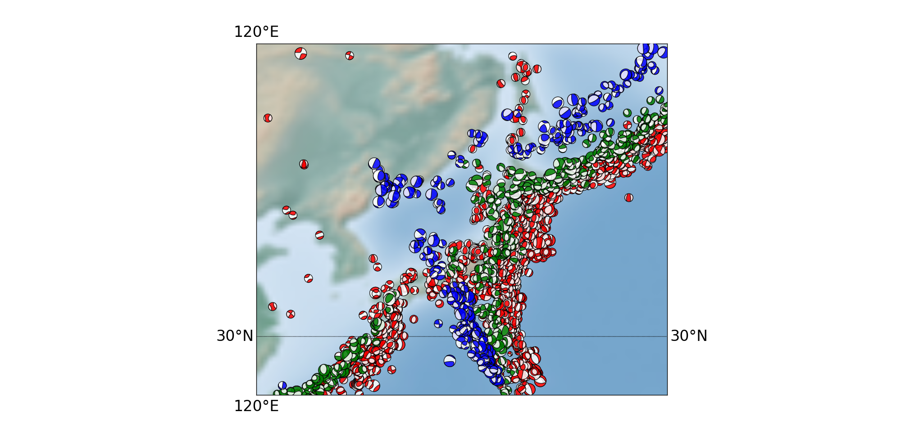

----------------
Folder structure
----------------

obspyDMT organizes the retrieved and processed data in a homogeneous way. When you want to run the code, you can specify a top-level folder path in which all the data will be organized:

::

    $ obspyDMT --datapath '/path/to/my/desired/address'

obspyDMT will create the folder (*/path/to/my/desired/address*) then start to create folders and files during retrieving and processing as it is shown in the following figure: 

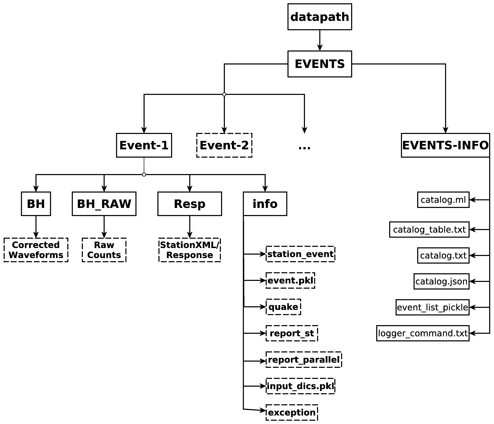

-----------------
Available options
-----------------

All the options currently available in obspyDMT could be seen by:

::

    $ obspyDMT --help

The options specified by *--option=OPTION* are type-1 (with value) and *--option* are type-2 (without value).
Please refer to `Option types`_ section for more info about type 1 and type 2.

As you can see, there are lots of available options (not necessarily required for your work) and it is difficult to explore them. An alternative to this is to list option groups by:

::

    $ obspyDMT --options

And to know the available options in each group: (in this example, we are interested in option group number 2 [Path specification])

::

    $ obspyDMT --list_option 2

---------
Algorithm
---------

obspyDMT works in different modes (event-based request, continuous request, updating mode, plotting and instrument correction), here is the flow chart of the main steps in each mode:

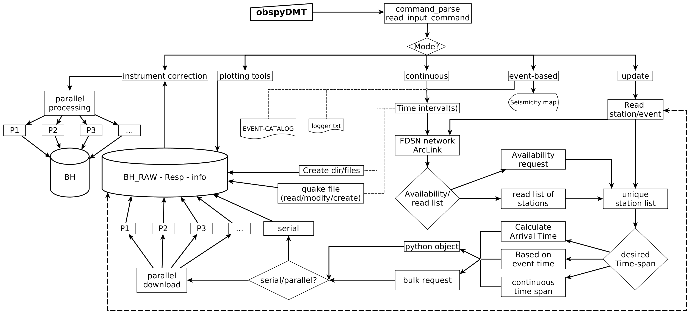

--------------------------
Example: RHUM-RUM stations
--------------------------

In this part of the tutorial, we focus on retrieving and processing of *RHUM-RUM* stations designed for *RHUM-RUM* students/researchers:

To create a list of all available stations in *YV* network hosted in *RESIF* data center:

::

    cd /path/to/obspyDMT/utils
    python create_list_stas.py

This will generate *list_stas_created.txt* file that contains all the available YV channels (on March 6, 2015: 105 channels).

In case that you want to work with specific channels (e.g. BHZ), it should be enough to change the inputs in *create_list_stas.py* (at top of the script) to your desired setting and re-run the code.

Moreover, we have put some example lists at:

::

    cd /path/to/obspyDMT/rhum_rum_stations

**Retrieving and Processing**

As an example, to retrieve all *YV* stations for events happened in 2013-09-01 to 2013-10-01 with minimum magnitude 7.5:

::

    obspyDMT --datapath yv_example --min_date 2013-09-01 --max_date 2013-10-01 --min_mag 7.5 --fdsn_base_url RESIF --fdsn_user 'your_user_name' --fdsn_pass 'your_password' --list_stas rhum_rum_stations/YV_list_HZ.txt

**Do not forget to enter your username and password**

In which *--datapath* specifies the directory to store the retrieved data,
*--min_date*, *--max_date* and *--min_mag* are searching parameters for
events, *--fdsn_base_url* should be set to *RESIF* with *--fdsn_user* and
*fdsn_pass* for username and password. *--list_stas* is the address of the
station list created in the previous step.

If it is too slow, you can try:

::

    obspyDMT --datapath yv_example --min_date 2013-09-01 --max_date 2013-10-01 --min_mag 7.5 --fdsn_base_url RESIF --fdsn_user 'your_user_name' --fdsn_pass 'your_password' --list_stas rhum_rum_stations/YV_list_HZ.txt --req_parallel --req_np 4

To check the source-receiver pairs retrieved in this request:

::

    obspyDMT --plot_dir yv_example --min_date 2013-01-01 --plot_sta --plot_ev --plot_ray

*--plot_dir* is the address of the stored data, *--min_date* filters the
events (here we only have one event), *--plot_sta* to plot stations,
*--plot_ev* to plot events and *--plot_ray* to plot rays between sources and
receivers.

obspyDMT automatically corrects the waveforms too (you can change the default values, refer to `Instrument correction`_). To plot the corrected waveforms:

::

    obspyDMT --plot_dir yv_example --min_date 2013-01-01 --plot_epi --plot_type corrected

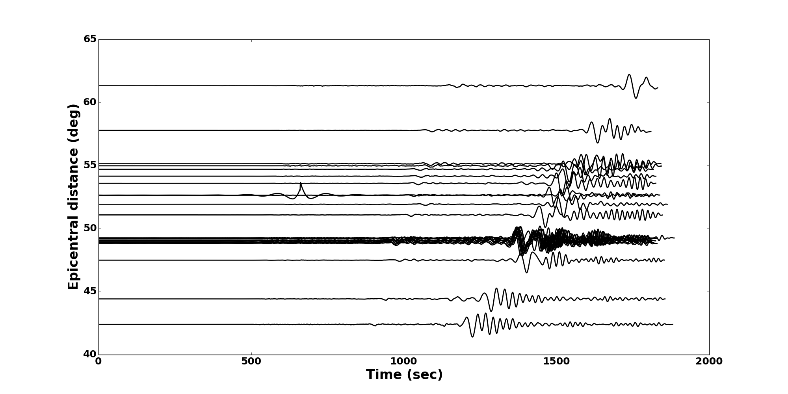

**More Stations**

**YA stations (2009-01-01 to 2011-12-31)**

Part of the data is available with *YA* code at *RESIF*. Following the same
procedure as above: (for the great Tohoku-oki earthquake of magnitude Mw 9.0)

::

    obspyDMT --datapath ya_example --min_date 2011-03-01 --max_date 2011-03-30 --min_mag 8.9 --fdsn_base_url RESIF --fdsn_user 'your_user_name' --fdsn_pass 'your_password' --list_stas rhum_rum_stations/YA_list_HZ.txt --req_parallel --req_np 4

To check the source-receiver pairs retrieved in this request:

::

    obspyDMT --plot_dir ya_example --min_date 2011-01-01 --plot_sta --plot_ev --plot_ray

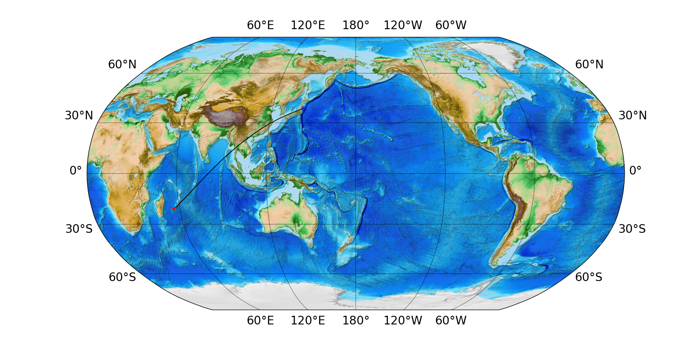

Zoom into the station cluster:

.. Here, you could also find some of the options available in obspyDMT with a short description.
.. Options marked by (*) or (**) are:
.. 
.. (*): *option-1* (with value)
.. 
.. (**): *option-2* (without value)
.. 
.. Please refer to `Option types`_ section for more info about type 1 and type 2
.. 
.. +-----------------------+-----------------------+---+-----------------------+-----------------------+
.. | options               | description           |   | options               | description           |
.. +=======================+=======================+===+=======================+=======================+
.. | --help                | show all the available|   | --test                | test the program for  |
.. |                       | flags with a short    |   |                       | the desired number of |
.. |                       | description for each  |   |                       | requests, eg:         |
.. |                       | and exit (**)         |   |                       | *--test 10* will test |
.. |                       |                       |   |                       | the program for 10    |
.. |                       |                       |   |                       | requests.             |
.. |                       |                       |   |                       | [Default: *N*] (*)    |
.. +-----------------------+-----------------------+---+-----------------------+-----------------------+
.. | --version             | show the obspyDMT     |   | --iris_update         | update the specified  |
.. |                       | version and exit (**) |   |                       | folder for IRIS,      |
.. |                       |                       |   |                       | syntax:               |
.. |                       |                       |   |                       | --iris_update         |
.. |                       |                       |   |                       | address_of_the        |
.. |                       |                       |   |                       | _target_folder.       |
.. |                       |                       |   |                       | [Default: *N*] (*)    |
.. +-----------------------+-----------------------+---+-----------------------+-----------------------+
.. | --check               | check all the         |   | --arc_update          | update the specified  |
.. |                       | dependencies and      |   |                       | folder for ArcLink,   |
.. |                       | their installed       |   |                       | syntax:               |
.. |                       | versions on the       |   |                       | --arc_update          |
.. |                       | local machine         |   |                       | address_of_the        |
.. |                       | and exit (**)         |   |                       | _target_folder.       |
.. |                       |                       |   |                       | [Default: *N*] (*)    |
.. +-----------------------+-----------------------+---+-----------------------+-----------------------+
.. | --type                | type of the input     |   | --update_all          | update the specified  |
.. |                       | (*command* or *file*) |   |                       | folder for both IRIS  |
.. |                       | to be read            |   |                       | and ArcLink,          |
.. |                       | by obspyDMT. Please   |   |                       | syntax: --update_all  |
.. |                       | note that for         |   |                       | address_of_the        |
.. |                       | *--type 'file'* an    |   |                       | _target_folder.       |
.. |                       | external file         |   |                       | [Default: *N*] (*)    |
.. |                       | (*INPUT.cfg*) should  |   |                       |                       |
.. |                       | exist in the same     |   |                       |                       |
.. |                       | directory as          |   |                       |                       |
.. |                       | obspyDMT.py           |   |                       |                       |
.. |                       | [Default: command] (*)|   |                       |                       |
.. +-----------------------+-----------------------+---+-----------------------+-----------------------+
.. | --reset               | if the datapath is    |   | --iris_ic             | apply instrument      |
.. |                       | found deleting it     |   |                       | correction to the     |
.. |                       | before running        |   |                       | specified folder for  |
.. |                       | obspyDMT. (**)        |   |                       | the downloaded        |
.. |                       |                       |   |                       | waveforms from        |
.. |                       |                       |   |                       | IRIS, syntax:         |
.. |                       |                       |   |                       | --iris_ic address_of  |
.. |                       |                       |   |                       | _the_target_folder.   |
.. |                       |                       |   |                       | [Default: *N*] (*)    |
.. +-----------------------+-----------------------+---+-----------------------+-----------------------+
.. | --datapath            | the path where        |   | --arc_ic              | apply instrument      |
.. |                       | obspyDMT will store   |   |                       | correction to the     |
.. |                       | the data [Default:    |   |                       | specified folder for  |
.. |                       | *./obspyDMT-data*] (*)|   |                       | the downloaded        |
.. |                       |                       |   |                       | waveforms from        |
.. |                       |                       |   |                       | ArcLink, syntax:      |
.. |                       |                       |   |                       | --arc_ic address_of   |
.. |                       |                       |   |                       | _the_target_folder.   |
.. |                       |                       |   |                       | [Default: *N*] (*)    |
.. +-----------------------+-----------------------+---+-----------------------+-----------------------+
.. | --min_date            | start time, syntax:   |   | --iris_ic_auto        | apply instrument      |
.. |                       | Y-M-D-H-M-S (eg:      |   |                       | correction            |
.. |                       | *2010-01-01-00-00-00*)|   |                       | automatically after   |
.. |                       | or just Y-M-D         |   |                       | downloading the       |
.. |                       | [Default: 10 days ago]|   |                       | waveforms from IRIS.  |
.. |                       | (*)                   |   |                       | [Default: *Y*] (*)    |
.. +-----------------------+-----------------------+---+-----------------------+-----------------------+
.. | --max_date            | end time, syntax:     |   | --arc_ic_auto         | apply instrument      |
.. |                       | Y-M-D-H-M-S (eg:      |   |                       | correction            |
.. |                       | *2011-01-01-00-00-00*)|   |                       | automatically after   |
.. |                       | or just Y-M-D         |   |                       | downloading the       |
.. |                       | [Default: 5 days ago] |   |                       | waveforms from        |
.. |                       | (*)                   |   |                       | ArcLink.              |
.. |                       |                       |   |                       | [Default: *Y*] (*)    |
.. +-----------------------+-----------------------+---+-----------------------+-----------------------+
.. | --min_mag             | minimum magnitude.    |   | --ic_all              | apply instrument      |
.. |                       | [Default: 5.5]        |   |                       | correction to the     |
.. |                       | (*)                   |   |                       | specified folder      |
.. |                       |                       |   |                       | for all the waveforms |
.. |                       |                       |   |                       | (IRIS and ArcLink),   |
.. |                       |                       |   |                       | syntax: --ic_all      |
.. |                       |                       |   |                       | address_of_the        |
.. |                       |                       |   |                       | _target_folder.       |
.. |                       |                       |   |                       | [Default: *N*] (*)    |
.. +-----------------------+-----------------------+---+-----------------------+-----------------------+
.. | --max_mag             | maximum magnitude.    |   | --ic_no               | do not apply          |
.. |                       | [Default: 9.9]        |   |                       | instrument correction |
.. |                       | (*)                   |   |                       | automatically.        |
.. |                       |                       |   |                       | This is equivalent    |
.. |                       |                       |   |                       | to: *--iris_ic_auto N |
.. |                       |                       |   |                       | --arc_ic_auto N* (**) |
.. +-----------------------+-----------------------+---+-----------------------+-----------------------+
.. | --min_depth           | minimum depth.        |   | --pre_filt            | apply a bandpass      |
.. |                       | [Default: +10.0       |   |                       | filter to the data    |                                          
.. |                       | (above the surface!)] |   |                       | trace before          |               
.. |                       | (*)                   |   |                       | deconvolution         |
.. |                       |                       |   |                       | (*None* if you do not |
.. |                       |                       |   |                       | need pre_filter),     | 
.. |                       |                       |   |                       | syntax:               |
.. |                       |                       |   |                       | *(f1,f2,f3,f4)* which |
.. |                       |                       |   |                       | are the four corner   |
.. |                       |                       |   |                       | frequencies of a      |
.. |                       |                       |   |                       | cosine taper, one     |
.. |                       |                       |   |                       | between f2 and f3     |
.. |                       |                       |   |                       | and tapers to zero    |
.. |                       |                       |   |                       | for f1 < f < f2 and   |
.. |                       |                       |   |                       | f3 < f < f4.          |
.. |                       |                       |   |                       | [Default:             |
.. |                       |                       |   |                       | *(0.008, 0.012, 3.0,  |
.. |                       |                       |   |                       | 4.0)*] (*)            |
.. +-----------------------+-----------------------+---+-----------------------+-----------------------+
.. | --max_depth           | maximum depth.        |   | --corr_unit           | correct the raw       |
.. |                       | [Default: -6000.0]    |   |                       | waveforms for DIS (m),| 
.. |                       | (*)                   |   |                       | VEL (m/s) or          |
.. |                       |                       |   |                       | ACC (m/s^2).          |
.. |                       |                       |   |                       | [Default: DIS] (*)    |
.. +-----------------------+-----------------------+---+-----------------------+-----------------------+
.. | --event_rect          | search for all the    |   | --zip_w               | compress the          |
.. |                       | events within the     |   |                       | raw-waveform files    |                                            
.. |                       | defined rectangle,    |   |                       | after applying        |                                         
.. |                       | GMT syntax:           |   |                       | instrument correction.|                                         
.. |                       | <lonmin>/<lonmax>/    |   |                       | (**)                  |                            
.. |                       | <latmin>/<latmax>     |   |                       |                       |                            
.. |                       | [Default:             |   |                       |                       |                    
.. |                       | -180.0/+180.0         |   |                       |                       |                       
.. |                       | /-90.0/+90.0] (*)     |   |                       |                       |   
.. +-----------------------+-----------------------+---+-----------------------+-----------------------+
.. | --max_result          | maximum number of     |   | --zip_r               | compress the response |
.. |                       | events to be          |   |                       | files after applying  |                                         
.. |                       | requested.            |   |                       | instrument correction.|                                        
.. |                       | [Default: 2500] (*)   |   |                       | (**)                  |   
.. +-----------------------+-----------------------+---+-----------------------+-----------------------+
.. | --get_events          | event-based request   |   | --iris_merge          | merge the IRIS        |
.. |                       | (please refer to      |   |                       | waveforms in the      |                                         
.. |                       | the tutorial).        |   |                       | specified folder,     |                                        
.. |                       | [Default: *Y*] (*)    |   |                       | syntax: --iris_merge  |                
.. |                       |                       |   |                       | address_of_the        |
.. |                       |                       |   |                       | _target_folder.       |
.. |                       |                       |   |                       | [Default: *N*] (*)    |
.. +-----------------------+-----------------------+---+-----------------------+-----------------------+
.. | --continuous          | continuous request    |   | --arc_merge           | merge the ArcLink     |
.. |                       | (please refer to the  |   |                       | waveforms in the      |                                             
.. |                       | tutorial). (**)       |   |                       | specified folder,     |         
.. |                       |                       |   |                       | syntax: --arc_merge   |
.. |                       |                       |   |                       | address_of_the        |
.. |                       |                       |   |                       | _target_folder.       |
.. |                       |                       |   |                       | [Default: *N*] (*)    |
.. +-----------------------+-----------------------+---+-----------------------+-----------------------+
.. | --interval            | time interval for     |   | --iris_merge_auto     | merge automatically   |
.. |                       | dividing the          |   |                       | after downloading     |                                      
.. |                       | continuous request.   |   |                       | the waveforms from    |                                             
.. |                       | [Default: 86400 sec   |   |                       | IRIS.                 |                                 
.. |                       | (1 day)] (*)          |   |                       | [Default: *Y*] (*)    |           
.. +-----------------------+-----------------------+---+-----------------------+-----------------------+
.. | --iris_bulk           | using the IRIS        |   | --arc_merge_auto      | merge automatically   |
.. |                       | bulkdataselect        |   |                       | after downloading     |                                        
.. |                       | Web service.          |   |                       | the waveforms         |                                  
.. |                       | Since this method     |   |                       | from ArcLink.         |                                       
.. |                       | returns multiple      |   |                       | [Default: *Y*] (*)    |                                        
.. |                       | channels of time      |   |                       |                       |                           
.. |                       | series data for       |   |                       |                       |                          
.. |                       | specified time ranges |   |                       |                       |                                
.. |                       | in one request,       |   |                       |                       |                          
.. |                       | it speeds up the      |   |                       |                       |                           
.. |                       | waveform retrieving   |   |                       |                       |                              
.. |                       | approximately by      |   |                       |                       |                           
.. |                       | a factor of two.      |   |                       |                       |                           
.. |                       | [RECOMMENDED] (**)    |   |                       |                       | 
.. +-----------------------+-----------------------+---+-----------------------+-----------------------+
.. | --waveform            | retrieve the waveform.|   | --merge_all           | merge all waveforms   |
.. |                       | [Default: *Y*] (*)    |   |                       | (IRIS and ArcLink) in |
.. |                       |                       |   |                       | the specified folder, |
.. |                       |                       |   |                       | syntax: --merge_all   |
.. |                       |                       |   |                       | address_of_the        |
.. |                       |                       |   |                       | _target_folder.       |
.. |                       |                       |   |                       | [Default: *N*] (*)    |
.. +-----------------------+-----------------------+---+-----------------------+-----------------------+
.. | --response            | retrieve the response |   | --merge_no            | do not merge          |
.. |                       | file. [Default: *Y*]  |   |                       | automatically. This is| 
.. |                       | (*)                   |   |                       | equivalent to:        |
.. |                       |                       |   |                       | *--iris_merge_auto N  |
.. |                       |                       |   |                       | --arc_merge_auto N*   |
.. |                       |                       |   |                       | (**)                  |
.. +-----------------------+-----------------------+---+-----------------------+-----------------------+
.. | --iris                | send request          |   | --merge_type          | merge *raw* or        |
.. |                       | (waveform/response)   |   |                       | *corrected* waveforms.|                                                  
.. |                       | to IRIS.              |   |                       | [Default: *raw*]      |                                  
.. |                       | [Default: *Y*] (*)    |   |                       | (*)                   | 
.. +-----------------------+-----------------------+---+-----------------------+-----------------------+
.. | --arc                 | send request          |   | --plot_iris           | plot waveforms        |
.. |                       | (waveform/response)   |   |                       | downloaded from IRIS. |                                                 
.. |                       | to ArcLink.           |   |                       | (*)                   |                      
.. |                       | [Default: *Y*] (*)    |   |                       |                       | 
.. +-----------------------+-----------------------+---+-----------------------+-----------------------+
.. | --SAC                 | SAC format for saving |   | --plot_arc            | plot waveforms        |
.. |                       | the waveforms. Station|   |                       | downloaded from       |                                              
.. |                       | location (stla and    |   |                       | ArcLink. (*)          |                                    
.. |                       | stlo), station        |   |                       |                       |                         
.. |                       | elevation (stel),     |   |                       |                       |                            
.. |                       | station depth (stdp), |   |                       |                       |                                
.. |                       | event location (evla  |   |                       |                       |                               
.. |                       | and evlo), event depth|   |                       |                       |                                 
.. |                       | (evdp) and event      |   |                       |                       |                           
.. |                       | magnitude (mag) will  |   |                       |                       |                               
.. |                       | be stored in the SAC  |   |                       |                       |                               
.. |                       | headers.              |   |                       |                       |                   
.. |                       | [Default: MSEED] (**) |   |                       |                       | 
.. +-----------------------+-----------------------+---+-----------------------+-----------------------+
.. | --time_iris           | generate a data-time  |   | --plot_all            | plot all waveforms    |
.. |                       | file for an IRIS      |   |                       | (IRIS and ArcLink).   |                                            
.. |                       | request. This file    |   |                       | [Default: *Y*] (*)    |                                          
.. |                       | shows the required    |   |                       |                       |                             
.. |                       | time for each request |   |                       |                       |                                
.. |                       | and the stored data   |   |                       |                       |                              
.. |                       | in the folder. (**)   |   |                       |                       |
.. +-----------------------+-----------------------+---+-----------------------+-----------------------+
.. | --time_arc            | generate a data-time  |   | --plot_type           | plot *raw* or         |
.. |                       | file for an ArcLink   |   |                       | *corrected* waveforms.|                                                  
.. |                       | request. This file    |   |                       | [Default: *raw*] (*)  |                                                
.. |                       | shows the required    |   |                       |                       |                             
.. |                       | time for each request |   |                       |                       |                                
.. |                       | and the stored data   |   |                       |                       |                              
.. |                       | in the folder. (**)   |   |                       |                       |
.. +-----------------------+-----------------------+---+-----------------------+-----------------------+
.. | --preset              | time parameter in     |   | --plot_ev             | plot all the events   |
.. |                       | seconds which         |   |                       | found in the specified|                                            
.. |                       | determines how close  |   |                       | folder, syntax:       |                                            
.. |                       | the time series data  |   |                       | --plot_ev address_of  |                                                 
.. |                       | (waveform) will be    |   |                       | _the_target_folder.   |                                             
.. |                       | cropped before the    |   |                       | [Default: *N*] (*)    |
.. |                       | origin time of the    |   |                       |                       |
.. |                       | event.                |   |                       |                       |
.. |                       | [Default: 0.0 seconds.|   |                       |                       |
.. |                       | ] (*)                 |   |                       |                       |
.. +-----------------------+-----------------------+---+-----------------------+-----------------------+
.. | --offset              | time parameter in     |   | --plot_sta            | plot all the stations |
.. |                       | seconds which         |   |                       | found in the specified|                                            
.. |                       | determines how close  |   |                       | folder, syntax:       |                                            
.. |                       | the time series data  |   |                       | --plot_sta address_of |                                                  
.. |                       | (waveform) will be    |   |                       | _the_target_folder.   |                                             
.. |                       | cropped after the     |   |                       | [Default: *N*] (*)    |                                         
.. |                       | origin time of the    |   |                       |                       |                             
.. |                       | event.                |   |                       |                       |                 
.. |                       | [Default:             |   |                       |                       |                   
.. |                       | 1800.0 seconds.] (*)  |   |                       |                       |
.. +-----------------------+-----------------------+---+-----------------------+-----------------------+
.. | --identity            | identity code         |   | --plot_se             | plot both all the     |
.. |                       | restriction, syntax:  |   |                       | stations and all the  |                                                 
.. |                       | net.sta.loc.cha       |   |                       | events found in the   |                                           
.. |                       | (eg: TA.*.*.BHZ to    |   |                       | specified folder,     |                                            
.. |                       | search for all BHZ    |   |                       | syntax: --plot_se     |                                            
.. |                       | channels in           |   |                       | address_of_the_target |                                         
.. |                       | TA network).          |   |                       | _folder.              |                                         
.. |                       | [Default: *.*.*.*] (*)|   |                       | [Default: *N*] (*)    | 
.. +-----------------------+-----------------------+---+-----------------------+-----------------------+
.. | --net                 | network code.         |   | --plot_ray            | plot the ray coverage |
.. |                       | [Default: '*'] (*)    |   |                       | for all the           |
.. |                       |                       |   |                       | station-event pairs   |
.. |                       |                       |   |                       | found in the specified| 
.. |                       |                       |   |                       | folder, syntax:       |
.. |                       |                       |   |                       | --plot_ray address    |
.. |                       |                       |   |                       | _of_the_target_folder.|
.. |                       |                       |   |                       | [Default: *N*] (*)    |
.. +-----------------------+-----------------------+---+-----------------------+-----------------------+
.. | --sta                 | station code.         |   | --plot_epi            | plot *epicentral      |
.. |                       | [Default: '*'] (*)    |   |                       | distance-time* for all| 
.. |                       |                       |   |                       | the waveforms found in| 
.. |                       |                       |   |                       | the specified folder, |
.. |                       |                       |   |                       | syntax: --plot_epi    |
.. |                       |                       |   |                       | address_of_the_target |
.. |                       |                       |   |                       | _folder.              |
.. |                       |                       |   |                       | [Default: *N*] (*)    |
.. +-----------------------+-----------------------+---+-----------------------+-----------------------+
.. | --loc                 | location code.        |   | --min_epi             | plot *epicentral      |
.. |                       | [Default: '*'] (*)    |   |                       | distance-time*        |
.. |                       |                       |   |                       | (refer to             |
.. |                       |                       |   |                       | *--plot_epi*) for all |
.. |                       |                       |   |                       | the waveforms with    |
.. |                       |                       |   |                       | epicentral-distance >=| 
.. |                       |                       |   |                       | min_epi.              |
.. |                       |                       |   |                       | [Default: 0.0] (*)    |
.. +-----------------------+-----------------------+---+-----------------------+-----------------------+
.. | --cha                 | channel code.         |   | --max_epi             | plot *epicentral      |
.. |                       | [Default: '*'] (*)    |   |                       | distance-time*        |
.. |                       |                       |   |                       | (refer to             |
.. |                       |                       |   |                       | *--plot_epi*) for all |
.. |                       |                       |   |                       | the waveforms with    |
.. |                       |                       |   |                       | epicentral-distance <=| 
.. |                       |                       |   |                       | max_epi.              |
.. |                       |                       |   |                       | [Default: 180.0] (*)  |
.. +-----------------------+-----------------------+---+-----------------------+-----------------------+
.. | --station_rect        | search for all the    |   | --plot_save           | the path where        |
.. |                       | stations within the   |   |                       | obspyDMT will store   |                                               
.. |                       | defined rectangle,    |   |                       | the plots             |                                    
.. |                       | GMT syntax:           |   |                       | [Default: '.'         |                                 
.. |                       | <lonmin>/<lonmax>/    |   |                       | (the same directory   |                                             
.. |                       | <latmin>/<latmax>.    |   |                       | as obspyDMT.py)] (*)  |                                                
.. |                       | May not be used       |   |                       |                       |                          
.. |                       | together with circular|   |                       |                       |                                 
.. |                       | bounding box station  |   |                       |                       |                               
.. |                       | restrictions          |   |                       |                       |                       
.. |                       | (station_circle)      |   |                       |                       |                           
.. |                       | [Default:             |   |                       |                       |                    
.. |                       | -180.0/+180.0/        |   |                       |                       |                        
.. |                       | -90.0/+90.0] (*)      |   |                       |                       |
.. +-----------------------+-----------------------+---+-----------------------+-----------------------+
.. | --station_circle      | search for all the    |   | --plot_format         | format of the plots   |
.. |                       | stations within the   |   |                       | saved on the local    |                                              
.. |                       | defined circle,       |   |                       | machine               |                               
.. |                       | syntax:               |   |                       | [Default: *png*] (*)  |                                     
.. |                       | <lon>/<lat>/          |   |                       |                       |                       
.. |                       | <rmin>/<rmax>.        |   |                       |                       |                          
.. |                       | May not be used       |   |                       |                       |                           
.. |                       | together with         |   |                       |                       |                         
.. |                       | rectangular bounding  |   |                       |                       |                                
.. |                       | box station           |   |                       |                       |                       
.. |                       | restrictions          |   |                       |                       |                        
.. |                       | (station_rect). (*)   |   |                       |                       |    
.. +-----------------------+-----------------------+---+-----------------------+-----------------------+
.. | --email               | send an email to the  |   |                       |                       |          
.. |                       | specified             |   |                       |                       |          
.. |                       | email-address after   |   |                       |                       |          
.. |                       | completing the job,   |   |                       |                       |          
.. |                       | syntax:               |   |                       |                       |          
.. |                       | --email email_address.|   |                       |                       |          
.. |                       | [Default: *N*] (*)    |   |                       |                       |          
.. +-----------------------+-----------------------+---+-----------------------+-----------------------+

.. obspyDMT: http://obspy.org/browser/obspy/trunk/apps/obspyDMT/obspyDMT.py
.. _obspyDMT: https://github.com/kasra-hosseini/obspyDMT
.. _ObsPy: https://github.com/obspy/obspy/wiki
.. _IRIS: http://www.iris.edu/ws/
.. _bulkdataselect: http://www.iris.edu/ws/bulkdataselect/
.. _ORFEUS: http://www.orfeus-eu.org/
.. _EMSC: http://www.emsc-csem.org/
.. _ArcLink: http://www.webdc.eu/arclink/
.. _http://pypi.python.org/pypi/obspyDMT: http://pypi.python.org/pypi/obspyDMT
.. _PyPI: http://pypi.python.org/pypi/obspyDMT
.. _GitHub: https://github.com/kasra-hosseini/obspyDMT
.. _pprocess: https://pypi.python.org/pypi/pprocess
.. _GMT5: http://gmt.soest.hawaii.edu/
.. _mechanize: http://wwwsearch.sourceforge.net/mechanize/
