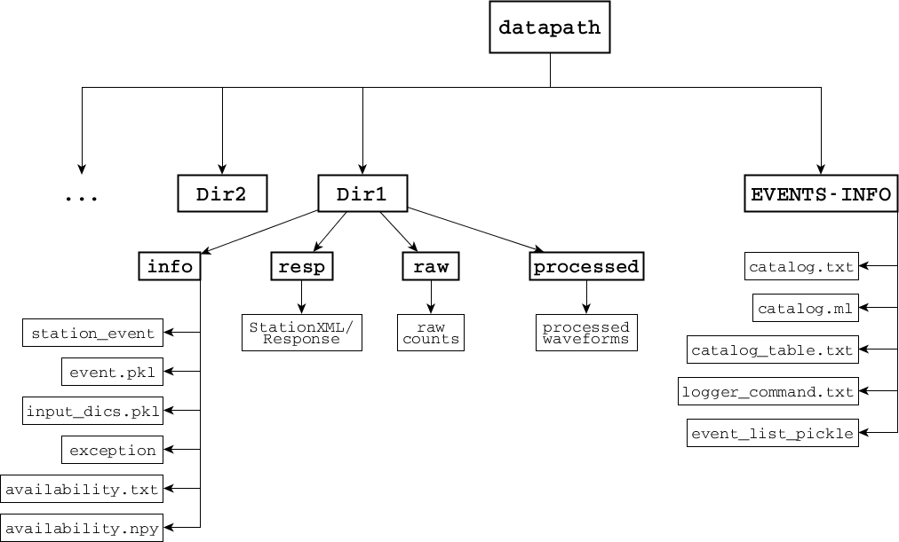

========================================================================================
obspyDMT: A Python Toolbox for Retrieving and Processing of Large Seismological Datasets
========================================================================================

Welcome to obspyDMT version 2.0.0 tutorial!

obspyDMT_ (obspy Data Management Tool) is a command line tool for retrieving, processing and management of large seismological datasets in a fully automatic way which can be run in serial or in parallel.

Software functionality:

-   Query of station meta-data: by absolute time or relative to earthquake occurrences; by geographic area (rectangles or circles); by channel or instrument type; wildcarding (\*) is supported; simultaneous queries of different data centers.

-   Query of earthquake source meta-data: from different catalogue providers (NEIC, Global CMT, IRIS DMC, NERIES, NCEDC, USGS, INGV and ISC); event origin information or full moment tensors; by time window, region, event magnitude and/or event depth.

-   Diagnostic plots to visualize meta-data; plots are generated by simple inclusion of an option flag.

-   Retrieval of actual waveform data (seismograms) according to the results of meta-data queries. Support for different protocols (FDSN web services, ArcLink).

-   Retrieval of time-continuous series of arbitrary length; diagnostic log files.

-   Parallelized retrieval of waveform data for increased speed. Simultaneous retrieval from different data centers.

-   Update mode: identical or modified queries can be relaunched; only new, modified, or previously failed data will be retrieved from the data center(s).

-   Tolerant of retrieval errors and missing data (includes diagnostic logs).

-   Automatic organisation of data, meta-data and log files into standardized directory trees. (At present no tie to any specific database system.)

-   Processing of the data set using default or user-defined processing function; user can customize the processing unit by writing a script in obspy, SAC and/or any other processing tool on the waveform level; Application to the whole data set directly after data-retrieval or as a separate step. Support for parallelized processing. 

-   Application of instrument responses. Support for various instrument formats (StationXML, Dataless SEED). Diagnostic plots of analog and digital filter stages. Option of parallelized instrument correction, taking advantage of multicore architectures even on desktop processors.

-   Retrieval of synthetic seismograms, for comparison to real data.

This tutorial has following sections: 

1.  `How to cite obspyDMT`_
2.  `Lets get started`_: install obspyDMT and check your local machine for required dependencies.
3.  `Quick tour`_: run a quick tour.
4. `Directory structure`_: the way that obspyDMT organizes your retrieved and processed data.

--------------------
How to cite obspyDMT
--------------------

If you use obspyDMT, please consider citing the code as:

::

    Kasra Hosseini (2015), obspyDMT (Version 1.0.0) [software] [https://github.com/kasra-hosseini/obspyDMT]

We have also published a paper in SRL (Seismological Research Letters) for obspyDMT's predecessor that we kindly ask you to cite in case that you found obspyDMT useful for your research:

::

    C. Scheingraber, K. Hosseini, R. Barsch, and K. Sigloch (2013), ObsPyLoad - a tool for fully automated retrieval of seismological waveform data, Seismological Research Letters, 84(3), 525-531, DOI:10.1785/0220120103.

.. _obspyDMT: https://github.com/kasra-hosseini/obspyDMT

----------------
Lets get started
----------------

Once a working *Python* and *ObsPy* environment is available, obspyDMT can be installed in different ways:

**1. install obspyDMT package locally (using PyPi):** One simple way to install obspyDMT is via PyPi:

::

    pip install obspyDMT

**2. install obspyDMT from the source code:** The latest version of obspyDMT is available on GitHub. After installing *git* on your machine:

::

    git clone
    https://github.com/kasra-hosseini/obspyDMT.git /path/to/my/obspyDMT
    cd /path/to/my/obspyDMT

obspyDMT can be installed then by:

::

    pip install -e .

or

::

    python setup.py install

obspyDMT can be used from a system shell without explicitly calling the *Python* interpreter. It contains various option flags for customizing the request. Each option has a reasonable default value and the user can change them to adjust obspyDMT option flags to a specific request. The following command gives all the available options with their default values:

::

    obspyDMT --help

There are lots of available options (not necessarily required for your work) and it is difficult to explore them. For this reason, a list of option groups can be generated by:

::

    obspyDMT --options

And to know the available options in each group: (For instance, if we are interested in option group number 2 [path specification])

::

    obspyDMT --list_option 2

To check the dependencies required for running the code properly:

::

    obspyDMT --check

Note that if obspyDMT is installed on your machine, it can be run from everywhere.

For sending the request to *NEIC* catalog, we use *mechanize* which can be installed via PyPi:

::

    pip install mechanize

----------
Quick tour
----------

To run a quick tour, it is enough to:

::

    obspyDMT --tour

*dmt_tour_dir* directory will be created in the current path and the retrieved/processed data will be organized there. (Please refer to `Directory structure`_ section for more information)

To have an overview on the retrieved raw counts, the waveforms can be plotted by:

::

    obspyDMT --datapath dmt_tour_dir --local --plot_waveform --min_date 2011-01-01

.. image:: figures/epi_time_20110311_1_raw.png
:scale: 60%
   :align: center

    for plotting the corrected waveforms:

::

    obspyDMT --datapath dmt_tour_dir --local --plot_waveform --min_date 2011-01-01 --plot_dir_name processed

.. image:: figures/epi_time_20110311_1.png
:scale: 60%
   :align: center

obspyDMT plots the ray coverage (ray path between each source-receiver pair) by:

::

    obspyDMT --datapath dmt_tour_dir --local --plot_ev --plot_sta --plot_ray --min_date 2011-01-01

.. image:: figures/tour_ray.png
:scale: 75%
   :align: center

It is also possible to change the map projection in the pop-up menu (with the same command line as above):

.. image:: figures/tour_ray_shaded.png
:scale: 75%
   :align: center

-------------------
Directory structure
-------------------

obspyDMT organizes the data in a simple and efficient way. For each request, it creates a parent directory at *datapath* and arranges the retrieved data either in different event directories (*event-based request*) or in chronologically named directories (*continuous request*). It also creates a directory in which a catalog of all requested events/time spans are stored. Raw waveforms, StationXML/response files and corrected waveforms are collected in sub-directories. While retrieving the data, obspyDMT creates metadata files such as station/event location files, and they are all stored in *info* directory of each event.

